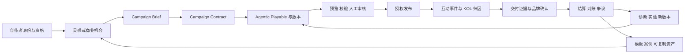

# Airvana 创作者中心：TapTap 与抖音对标及完整功能闭环可行性方案

> 版本：v2.0
> 日期：2026-08-13
> 文档状态：待产品确认；本轮只定义方案，不进入开发
> 当前实施边界：后端服务暂不开发；可先建设前端可验证原型，但不能把本地演示状态描述为真实商业能力
> 核心定位：让每一个 KOL 创作并运营属于自己的 Agentic Playable。KOL 是创作者、所有者和运营者；Agentic Playable 是可持续运营的营销智能体。

---

## 0. 最终建议

### 0.1 不整套复制任何一家

Airvana 最适合采用：

**TapTap 的游戏创作者生态骨架 + 抖音的日常运营驾驶舱 + Airvana 自己的 Campaign Contract、版本治理、归因与结算内核。**

如果只比较外部参考比例，建议：

- **TapTap 60%**：创作者身份、成长体系、活动/机会广场、投稿与审核、游戏素材和课程、规则中心、数据与收益状态；
- **抖音 40%**：阶段化首页、数据摘要、创作灵感、商业机会、今日任务、卡片级单一行动和创作者助手。

如果按最终产品来源拆分，建议：

- **Airvana 原生能力 50%**：Campaign Brief、Campaign Contract、Agentic Playable、版本、审批、KOL 专属归因、交付证据、结算、Kill Switch；
- **TapTap 借鉴 30%**：游戏创作者生态和活动运营骨架；
- **抖音借鉴 20%**：高效率的工作台、灵感与机会交互。

这不是视觉权重，而是产品责任边界。Airvana 的核心竞争力必须来自第三部分，不能停留在“游戏版创作者中心”或“抖音创作者中心换皮”。

### 0.2 为什么 TapTap 更适合作为骨架

TapTap 的创作者体系围绕游戏内容创作者、活动广场、投稿、创作数据、素材课程、创作支持和收益规则展开，和 Airvana 的游戏/互动内容语境更接近。官方资料显示，创作者可以申请身份、进入活动广场参与活动并投稿；创作者计划还提供高清游戏素材、课程、流量助推、社群、认证和运营支持。参考：[TapTap 创作者中心 F&Q](https://www.taptap.cn/moment/253926455778476358)、[TapTap 创作者计划](https://www.taptap.cn/moment/253853094369035471)。

但 TapTap 的主要对象仍是视频、评价、长帖、图文等游戏内容，不是可交互、可版本化、可绑定 Campaign Contract 的营销智能体。因此只能借鉴生态结构，不能照搬业务对象。

### 0.3 为什么抖音更适合作为驾驶舱

用户提供的抖音截图把账号状态、创作阶段、7 日数据、快捷工具、“创作灵感 / 创作变现”和卡片级行动集中在一个任务驾驶舱里，适合解决“现在做什么、为什么做、下一步点哪里”。官方开放平台也提供内容发布、互动管理、数据统计、热点、粉丝画像等能力，并要求授权和权限申请。参考：[抖音开放平台简介](https://open.douyin.com/platform/resource/docs/accession-guide/platform-introduction/)、[权限说明](https://open.douyin.com/platform/resource/docs/accession-guide/type-and-permission)、[视频数据接入方案](https://open.douyin.com/platform/resource/docs/ability/open-data/video-data-solution)。

但抖音的核心逻辑是内容分发、流量增长和商业转化；Airvana 的核心逻辑是 KOL 持续运营 Agentic Playable。因此应借鉴它的“决策效率”，不照搬热点、带货、收益承诺或内容平台指标。

---

## 1. 本次分析范围与证据边界

### 1.1 输入

1. 用户提供的抖音创作者中心截图；
2. 用户提供的 TapTap 创作者中心截图；
3. TapTap 与抖音当前可访问的官方资料；
4. 当前 Airvana 本地项目的创作者中心页面和既有需求文档；
5. Airvana 已确定的 Campaign Brief、Campaign Contract、Agentic Playable、KOL 归因和治理边界。

### 1.2 证据等级

| 标记 | 定义 |
| --- | --- |
| 截图可见 | 用户截图中直接可见的结构、文案或交互 |
| 官方确认 | 官方页面或开发者文档明确说明的能力 |
| 产品推断 | 根据页面和资料推导的设计意图，不代表平台官方表述 |
| 当前已实现 | 当前 Airvana 代码或本地页面已存在的前端能力 |
| Airvana 目标 | 本方案建议建设的目标能力 |
| 后端依赖 | 必须由服务端、第三方、人工审批或权威账本提供真值 |

### 1.3 时效说明

平台能力、权限、结算和准入规则会变化。本文对官方能力的判断以 2026-08-13 可访问资料为准；真正接入前必须重新核验权限、协议、数据范围和审核条件。

---

## 2. TapTap 与抖音的底层产品逻辑

### 2.1 TapTap：游戏内容生态型创作者中心

TapTap 的核心链路可以概括为：

`申请成为创作者 → 获得游戏素材/活动机会 → 创作内容 → 投稿审核 → 获得社区互动和流量 → 查看数据 → 获得活动或流量收益 → 继续创作`

官方资料支持的关键能力包括：

- 创作者身份申请和活动广场投稿：[创作者中心 F&Q](https://www.taptap.cn/moment/253926455778476358)；
- 游戏素材、课程、流量助推、社群、认证、签约与运营支持：[创作者计划](https://www.taptap.cn/moment/253853094369035471)；
- 账号、内容、涨粉、互动和创作表现数据，并明确统计周期和更新时间：[数据更新规则](https://www.taptap.cn/moment/224545602162132170)；
- 流量收益、活动收益、站外激励、月度结算、税务、反作弊与内容删除影响：[收益结算规则](https://www.taptap.cn/moment/224544615120765736)；
- 游戏内社区、发布、互动、通知、运营位和人工审核：[内嵌动态功能](https://developer.taptap.cn/docs/v2/sdk/embedded-moments/features/)；
- 在游戏运营期通过创作者内容合作帮助获客和增长：[TapTap 开发者服务](https://developer.taptap.cn/)。

它解决的是：

1. 谁可以成为游戏内容创作者；
2. 创作者从哪里获得活动、游戏和素材；
3. 内容如何投稿、审核和展示；
4. 数据和收益如何解释；
5. 创作者如何获得长期支持。

它不直接解决 Airvana 的：

- Campaign Contract 字段锁定；
- Agentic Playable 多版本与运行时治理；
- KOL 专属链接和服务端成功事件；
- 品牌交付证据与争议处理；
- 归因、用户奖励、KOL 结算三账本分离；
- 自动停止、回滚和 Kill Switch。

### 2.2 抖音：内容经营型创作者驾驶舱

抖音截图与官方能力共同呈现出另一种逻辑：

`账号/阶段 → 今日行动 → 灵感/热点 → 内容生产与发布 → 数据反馈 → 商业机会 → 持续运营`

官方开放能力包括：

- 面向创作者和服务商的用户、视频、内容、数据流程：[平台简介](https://open.douyin.com/platform/resource/docs/accession-guide/platform-introduction/)；
- 分享、发布、视频数据、评论、用户数据、粉丝画像和热点等权限：[权限说明](https://open.douyin.com/platform/resource/docs/accession-guide/type-and-permission)；
- 用户授权后获取视频统计数据：[视频数据接入方案](https://open.douyin.com/platform/resource/docs/ability/open-data/video-data-solution)；
- 视频分享、话题、小程序、数据分析和游戏内容传播链路：[通用解决方案](https://open.douyin.com/platform/resource/docs/accession-guide/common-solution/)；
- 沙盒、灰度发布以及获客、留存、转化、复访、促活的经营视角：[平台升级说明](https://open.douyin.com/platform/resource/docs/transfer)；
- 数据使用必须符合授权、最小必要和平台协议：[开放平台协议](https://open.douyin.com/platform/resource/docs/operation-standard/agreement-protocol)。

它解决的是：

1. 创作者今天先做什么；
2. 什么内容值得做；
3. 哪些工具可以马上使用；
4. 数据如何快速指导下一步；
5. 商业机会如何与日常创作并列。

它不适合 Airvana 直接照搬的部分：

- 以平台热点和流量为最高优先级；
- 把视频播放、粉丝和收入当作主要成功标准；
- 选品带货、创作基金等抖音特有商业模式；
- 一键发布后即视为商业交付完成；
- 用内容推荐算法替代 Campaign 的资格、合同和合规判断。

---

## 3. 逐模块适配度对比

评分说明：5 为非常适合借鉴，1 为不适合直接借鉴。评分是 Airvana 产品适配判断，不是对平台优劣的评价。

| 模块 | TapTap | 抖音 | Airvana 结论 |
| --- | ---: | ---: | --- |
| 游戏/互动内容语境 | 5 | 3 | 以 TapTap 为参考，但对象从游戏内容变成 Agentic Playable |
| 创作者身份与入驻 | 5 | 4 | 借鉴 TapTap 的申请、资格、规则和支持体系 |
| 成长阶段与今日任务 | 3 | 5 | 借鉴抖音的一阶段一行动 |
| 灵感发现 | 3 | 5 | 借鉴抖音的灵感流，但来源改成玩法、Campaign、受众需求和诊断 |
| 活动/机会广场 | 5 | 4 | 用 TapTap 活动广场结构，升级为 Campaign Opportunity Plaza |
| 投稿、审核、复审 | 5 | 4 | 借鉴 TapTap 的状态透明；Airvana 增加版本、审批和回滚 |
| 游戏素材与课程 | 5 | 4 | 建设素材库、玩法模板、案例和合规课程 |
| 首页数据摘要 | 3 | 5 | 用抖音式摘要，但指标改成 Playable 漏斗和交付状态 |
| 社区与粉丝反馈 | 5 | 5 | 作为灵感来源，不直接等同商业成功 |
| 商业任务与交付 | 3 | 5 | 用抖音式机会呈现；业务规则由 Contract 控制 |
| 外部发布与数据接入 | 4 | 5 | 均需官方授权；第一阶段不能承诺真实接入 |
| 收益/结算展示 | 4 | 4 | 仅借鉴状态和规则透明，不复制计算方式和文案 |
| Agentic Playable 版本治理 | 1 | 1 | 必须由 Airvana 原生建设 |
| 品牌目标、归因和证据 | 2 | 3 | 必须由 Airvana 原生建设 |
| 合规锁定与 Kill Switch | 2 | 3 | 必须由 Airvana 原生建设 |

### 3.1 选择结论

- **产品骨架选 TapTap**：因为创作者围绕游戏/互动内容成长、参加活动、提交作品、接受审核和获得支持；
- **首页与日常操作选抖音**：因为它最擅长把复杂能力压缩成阶段、指标、灵感、机会和下一步；
- **商业闭环不选任何一家**：由 Airvana 的 Campaign Contract、Playable 版本、归因、交付、结算和治理构成。

---

## 4. 当前 Airvana 创作者中心审计

### 4.1 已有能力

当前本地创作者中心已经显示：

- Agentic Playable 增长闭环；
- Campaign 交付中心；
- 今日推荐任务；
- Agent 运营、效果归因、商业结算三个运营入口；
- 发布检查、Campaign 审批、归因证据、可复制版本等待处理事项；
- 创作者身份、品牌合作、Campaign Contract、审核发布和连接器等关联能力。

因此，不需要再新建一套平行的“创作者中心业务”。重点应是把现有能力重组为可理解、可继续、可验证的任务链。

### 4.2 当前断点

| 断点 | 当前表现 | 后果 |
| --- | --- | --- |
| 缺少创作者身份摘要 | 进入页面先看到抽象增长闭环 | 不知道账号、KYC、商业权限是否正常 |
| 缺少成长阶段 | 待办事项与今日任务并列 | 新创作者不知道先完成什么 |
| 缺少灵感工作区 | 只有“今日推荐任务” | 没有玩法、Campaign、受众需求和诊断来源 |
| 缺少机会发现上游 | 已有 Campaign 交付，没有机会广场 | 无法完成发现、资格、申请、受邀和接受 |
| 数据没有形成动作 | 归因是独立入口 | 无法从漏斗问题生成下一版本假设 |
| 结算过早出现 | 服务未接入但入口可见 | 容易被理解为已有真实商业结算 |
| 学习与规则缺失 | 只有功能入口 | 新创作者缺少素材、案例、规则和支持 |
| 状态真值不统一 | 本地演示、未来服务和人工状态视觉接近 | 容易把演示当成真实审核、转化或收入 |

### 4.3 重构原则

1. 保留现有 Campaign、归因、结算和治理模块，改变入口与状态组织；
2. 新增的是“身份、成长、灵感、机会、学习”上游，而不是复制已有交付页；
3. 首页每个模块都必须有明确下一步；
4. 任何商业结果必须显示证据来源和确认状态；
5. 没有后端时只验证交互与状态模型，不声称完成真实闭环。

---

## 5. 目标产品定义

Airvana 创作者中心应定义为：

**面向 KOL 的 Agentic Playable 创作、Campaign 合作、交付和持续运营驾驶舱。它把灵感、Brief、Contract、创作、审核、发布、互动、归因、交付、结算和复盘组织成可继续、可解释、可追踪的任务链。**

它不是：

- 个人主页的功能抽屉；
- 视频热点和流量榜单；
- 没有资格与合同约束的赚钱任务大厅；
- 把 CTA 点击包装成注册、KYC 或购买的平台；
- 允许 AI 自动签约、改预算、发布、结算的控制台。

---

## 6. 完整功能闭环

### 6.1 总闭环



### 6.2 自主创作闭环

`灵感 → Brief 草稿 → 自有创作 Contract → Playable → 审核 → 站内发布 → 数据 → 诊断 → 新版本`

适用场景：KOL 自主创建非品牌 Campaign 的 Agentic Playable。

完成条件：

- Brief 必填字段齐全；
- Contract 明确目标、地区、CTA、事件和治理边界；
- 版本通过校验和人工审核；
- 发布后有可验证事件；
- 诊断能生成一个受约束的下一版本假设。

### 6.3 品牌 Campaign 闭环

`机会可见 → 资格判断 → 申请/受邀 → 品牌或平台审核 → Contract 确认 → 创作 → 交付审核 → 发布 → 归因 → 对账 → 结算 → 复用`

完成条件：

- 机会来源、品牌身份和资格要求可追溯；
- KOL 与品牌确认同一份版本化 Contract；
- 交付物、事件、归因、结算和争议规则已定义；
- 发布和外部连接器有授权记录；
- 成功事件来自批准的权威系统；
- 结算结果和交付证据可复核。

### 6.4 运营优化闭环

`运行数据 → 漏斗诊断 → 优化假设 → KOLCreativePatch → 预览/审批 → 新版本 → 灰度/实验 → 比较 → 保留或回滚`

完成条件：

- 假设只改变 Contract 允许字段；
- 实验使用稳定分组和同一指标口径；
- 新旧版本不串数据；
- 失败可暂停、回滚或触发 Kill Switch；
- 结论沉淀到案例、模板或禁用规则。

### 6.5 创作者成长闭环

`申请身份 → 完善资料 → 首个 Brief → 首个 Playable → 首次审核 → 首次发布 → 首次有效互动 → 首次 Campaign 交付 → 持续运营`

每个阶段只突出一个主动作，成熟创作者不再长期看到“创建首个作品”。

---

## 7. 目标信息架构

### 7.1 移动端主结构

```text
创作者中心
├─ 工作台
│  ├─ 身份与资格
│  ├─ 当前阶段 / 今日唯一主任务
│  ├─ 7 日运营摘要
│  ├─ 当前 Campaign 与异常提醒
│  ├─ 推荐灵感 2 条
│  └─ 商业机会 2 条
├─ 创作灵感
│  ├─ 为你推荐
│  ├─ 官方 Campaign
│  ├─ 玩法与模板
│  ├─ 受众需求
│  └─ 优化机会
├─ 商业机会
│  ├─ 推荐机会
│  ├─ 受邀
│  ├─ 已申请
│  ├─ 进行中
│  ├─ 待处理
│  └─ 已完成
├─ 我的 Agentic Playables
├─ Campaign 交付
├─ 数据与归因
├─ 结算与对账
└─ 学院、素材与规则
```

### 7.2 首页主导航建议

移动端第一阶段只保留三个主标签：

`工作台 / 创作灵感 / 商业机会`

“我的 Playables、数据、交付、结算、学院”作为工作台快捷入口和二级页面，不再把所有功能平铺成首页宫格。

### 7.3 首页首屏优先级

1. 创作者身份、KYC、商业权限异常；
2. 当前阶段和唯一主任务；
3. 即将截止、待补材料、审核驳回、发布暂停、归因缺失、结算争议；
4. 7 日运营摘要；
5. 灵感与机会推荐；
6. 学习、规则和运营支持。

---

## 8. 详细功能设计

### 8.1 工作台

| 模块 | 关键内容 | 主动作 |
| --- | --- | --- |
| 身份与资格 | 创作者、账号、KYC、商业权限分开显示 | 修复资格或查看详情 |
| 当前阶段 | 当前目标、完成条件、证据状态、进度 | 继续唯一主任务 |
| 7 日摘要 | 有效开始、完成率、CTA 点击、已确认成功事件 | 查看数据与诊断 |
| 当前 Campaign | Contract 状态、截止时间、下一交付物 | 继续交付 |
| 异常中心 | 驳回、缺材料、发布暂停、归因缺失、争议 | 处理异常 |
| 灵感预览 | 2 条高相关灵感及推荐原因 | 生成 Brief 草稿 |
| 机会预览 | 2 条满足可见条件的机会 | 查看资格或申请 |

要求：

- 每张卡只有一个主 CTA；
- 数据为 `—` 时说明缺少什么，不用虚构数字填充；
- 本地状态统一标记“演示”；
- 今日任务、Campaign 待办和成长任务不可混在同一列表里。

### 8.2 创作灵感

灵感来源：

1. 平台或品牌批准的官方 Campaign；
2. 玩法与模板库；
3. 用户评论、消息、搜索或粉丝需求；
4. 已有 Playable 的漏斗诊断；
5. 运营人员配置的主题；
6. AI 基于批准数据生成的建议。

每张灵感卡至少包含：

- 来源、更新时间和证据状态；
- 标题、摘要和适合的目标；
- 为什么推荐给该 KOL；
- 适用受众、地区、语言和玩法；
- 所需素材、制作复杂度和风险；
- 收藏、隐藏、不感兴趣；
- `生成 Brief 草稿` 或 `优化现有 Playable`。

禁止：

- 把未经验证的热度、收益或转化作为保证；
- 用“AI 推荐”隐藏来源和判断依据；
- 灵感卡直接生成可发布的生产版本。

### 8.3 商业机会 / Campaign Opportunity Plaza

借鉴 TapTap 活动广场的“活动—规则—投稿—审核—收益”结构，但升级为：

`机会—资格—申请/邀请—Contract—创作—交付—归因—结算`

机会卡字段：

- 品牌/发起方及验证状态；
- Campaign 名称、目标和成功事件；
- 地区、语言、受众、时间和截止日期；
- 玩法、交付物和素材要求；
- 创作者资格、KYC、能力和档期；
- Contract、归因、结算字段是否已经定义；
- 资格结果与具体原因；
- 主要动作。

资格结果必须支持：

| 状态 | 前端行为 |
| --- | --- |
| 可申请 | 显示申请材料和截止时间 |
| 受邀 | 显示邀请来源、确认时限和 Contract 摘要 |
| 条件未满足 | 显示缺少资格和修复入口 |
| 待人工确认 | 可收藏或补充资料，不声称已参与 |
| 不适用 | 解释地区、年龄、合规、档期或能力原因 |

### 8.4 Campaign Brief

Brief 是所有生产流程的入口，不允许用聊天记录直接驱动生产。

最低字段：

```text
brand_or_owner
objective
primary_success_event
target_audience
regions_and_languages
channels
core_mechanic
brand_assets
cta
reward_rules
compliance_constraints
measurement
timeline
unknown_fields
```

灵感或机会只能预填草稿；缺失字段显示“待补充”，不能自动编造。

### 8.5 Campaign Contract

Contract 是 Brief 被批准后的版本化生产真值。

默认锁定：

- 预算与商业条款；
- 奖励类型、价值、库存、资格和履约；
- CTA 目的地；
- 包含/排除地区和最低年龄；
- 合规声明、禁止声明和品牌安全规则；
- 数据采集、同意和保留规则；
- 主要成功事件；
- 归因模型、窗口、优先级和排除项；
- 结算事件、币种、账期、争议和回退；
- 审批人、发布权限、暂停、回滚和 Kill Switch。

权限优先级：

`平台/品牌批准的 Contract > KOL 输入 > 模板默认值 > AI 建议`

### 8.6 我的 Agentic Playables

一个 KOL 可以创建、拥有并运营多个 Agentic Playable；每个 Playable 可以拥有多个版本。

建议生命周期：

`草稿 → 校验中 → 待审核 → 可发布 → 发布中 → 运行中 → 已暂停 → 已完成 → 已归档`

另行显示商业状态：

`无 Campaign / Contract 待确认 / 交付中 / 待归因 / 待对账 / 待结算 / 已结算 / 有争议`

不要把技术生命周期和商业生命周期塞进一个状态字段。

创建新 `playable_id` 的典型变化：

- 品牌；
- 核心目标；
- 主要结算指标；
- 目标地区；
- 主要受众；
- 新商业 Campaign。

创建新版本的典型变化：

- 视觉、文案、难度和玩法细节；
- CTA 展示时机；
- 经允许的素材替换；
- 受 Contract 约束的优化实验。

### 8.7 审核、发布与渠道连接器

发布门禁：

1. Contract 版本一致；
2. 素材授权和 Asset Manifest 完整；
3. 事件与归因配置通过；
4. 隐私、地区、声明和 CTA 校验通过；
5. 人工审批完成；
6. 渠道授权有效；
7. 回滚包和 Kill Switch 可用。

外部平台接入必须重新核验官方权限。例如抖音发布、视频数据、评论、粉丝画像和热点等能力存在不同权限等级与申请条件，不能把“开放平台有接口”写成“Airvana 已可使用”。参考：[抖音权限说明](https://open.douyin.com/platform/resource/docs/accession-guide/type-and-permission)。

### 8.8 数据与归因

标准事件漏斗：

`impression → play_start → valid_interaction → play_complete → cta_view → cta_click → approved success event`

关键规则：

- CTA 点击不是注册、KYC、购买或其他成功事件；
- 下游成功必须来自批准的服务端或权威外部系统；
- 每个事件包含 campaign、playable、version、KOL、channel、时间、同意和去重信息；
- KOL 专属链接可撤销，并携带 campaign、creative、channel、kol、link 标识；
- 用户权益、渠道/KOL 归因、品牌/KOL 结算使用独立账本。

默认数据模块：

1. 获取：曝光、有效开始、来源；
2. 体验：有效互动、完成、失败、重玩；
3. 行动：CTA 展示、CTA 点击；
4. 成功：批准系统确认的成功事件；
5. 质量：事件缺失、重复、延迟、机器人和异常流量；
6. 版本：新旧版本同口径比较；
7. Campaign：交付、归因和结算证据状态。

### 8.9 结算、对账与争议

真实结算接入前，页面只显示：

- `商业结算服务待接入`；
- `Contract 未定义`；
- `归因证据待确认`；
- `待人工复核`。

真实结算至少需要：

- settlement record 和版本化规则；
- 成功事件来源与去重结果；
- 币种、税费、账期和支付状态；
- 退款、撤销、迟到事件和作弊处理；
- 对账单、证据包、争议发起和人工裁决；
- 审批人与权威账本。

TapTap 的收益中心提供待结算、结算中、已结算、累计、税务和反作弊等明确规则，值得借鉴“状态透明和规则可查”，但 Airvana 不应复制其收入类型、税务处理或支付规则。参考：[TapTap 收益结算规则](https://www.taptap.cn/moment/224544615120765736)。

### 8.10 学院、素材与规则

借鉴 TapTap 对游戏创作者的素材和成长支持，建议建设：

- 玩法模板与可复用能力组合；
- 已授权品牌素材；
- 优秀 Agentic Playable 案例；
- Campaign Brief 和 Contract 教程；
- 事件、归因和结算基础课程；
- 合规、隐私、广告声明和地区规则；
- 审核驳回原因库；
- 创作者运营助手和人工客服。

---

## 9. 状态机与异常闭环

### 9.1 商业机会状态机

`可见 → 已收藏 → 已申请/受邀 → 资格审核 → Contract 待确认 → Contract 已确认 → 创作中 → 待交付 → 审核中 → 已批准 → 运行中 → 待归因 → 待对账 → 待结算 → 已完成`

异常状态：

- 资格不满足；
- 申请被拒绝；
- 待补材料；
- Contract 变更待双方确认；
- 审核驳回；
- 渠道授权失效；
- 发布失败或暂停；
- 归因证据缺失；
- 结算争议；
- Campaign 取消或归档。

每个异常必须包含：原因、责任方、修复动作、截止时间、证据和升级入口。

### 9.2 Review 状态机

`未提交 → 自动校验 → 待人工审核 → 已批准 / 已驳回 / 待补充 → 复审 → 已批准`

要求保留审核版本、原因、审核人、时间和修改差异。

### 9.3 Settlement 状态机

`未定义 → 已定义 → 待归因 → 待对账 → 待审批 → 已批准 → 支付处理中 → 已支付`

异常分支：`有争议 / 已冻结 / 已撤销 / 已退款 / 已取消`。

---

## 10. 核心对象与服务边界

### 10.1 核心对象

| 对象 | 责任 |
| --- | --- |
| `CreatorProfile` | 创作者身份、领域、语言、能力和联系方式 |
| `CreatorEligibility` | KYC、地区、商业权限、能力、档期和资格判断 |
| `CreatorStage` | 成长阶段、完成条件和证据 |
| `Inspiration` | 灵感来源、推荐原因、适配标签和证据状态 |
| `CampaignOpportunity` | 品牌机会、资格、时间、交付物和商业字段状态 |
| `CampaignBrief` | 结构化需求入口和未知字段 |
| `CampaignContract` | 批准、版本化、可审计的生产与商业约束 |
| `Playable` | KOL 拥有和运营的长期 Agentic Playable |
| `PlayableVersion` | 某次批准或实验版本 |
| `AssetManifest` | 素材、权利、来源、版本和使用范围 |
| `ReviewRequest` | 校验、人工审核、驳回和复审 |
| `ReleaseManifest` | 渠道、授权、灰度、回滚和发布证据 |
| `AttributionLink` | KOL/渠道/创意专属链接和撤销状态 |
| `EventEnvelope` | 标准事件、版本、同意和去重信息 |
| `Deliverable` | Campaign 交付物和品牌确认 |
| `SettlementRecord` | 结算规则、证据、对账、争议和支付状态 |
| `Experiment` | 假设、分组、指标、版本和结果 |
| `ReusableAsset` | 模板、案例、策略学习和禁用规则 |

### 10.2 服务端能力清单

完整生产闭环需要：

1. 身份、角色和 entitlement 服务；
2. 创作者资料、资格与 KYC 状态服务；
3. 机会与 Campaign 服务；
4. Brief/Contract 版本与审批服务；
5. Playable、版本、素材和发布服务；
6. 渠道 OAuth/连接器服务；
7. 事件采集、去重、反作弊和归因服务；
8. 交付证据和品牌确认服务；
9. 结算、对账、争议和支付服务；
10. 推荐、通知、学习和运营配置服务；
11. 审计日志、权限、暂停、回滚和 Kill Switch。

### 10.3 前端不得成为真值源的字段

- KYC 和身份审核结果；
- 品牌验证；
- Campaign 资格；
- Contract 批准；
- 发布成功；
- 外部转化；
- 归因结果；
- 应收、税费、已支付；
- 作弊或争议裁决。

---

## 11. 可行性评估

### 11.1 功能可行性矩阵

| 能力 | 当前基础 | 技术可行性 | 主要依赖 | 当前结论 |
| --- | --- | --- | --- | --- |
| 工作台重组 | 已有页面与本地状态 | 高 | 前端重构 | 可立即做 |
| 创作者阶段 | 已有身份和任务 | 高 | 状态模型 | 可先做演示闭环 |
| 灵感工作区 | 有推荐任务和创作器 | 高 | 灵感数据未来接入 | 可先用可解释本地规则 |
| 机会广场 | 有 Campaign 交付下游 | 高 | 品牌、资格、申请服务 | 前端可做，真实参与待后端 |
| Brief/Contract 串联 | 已有相关页面 | 高 | 版本与审批服务 | 本地可验证，生产需后端 |
| Playable 版本治理 | 已有版本概念 | 高 | 持久化、审批、发布 | 可分阶段建设 |
| 外部发布 | 有连接器 UI | 中 | OAuth、权限、平台审核 | 高外部依赖，不进 P0 承诺 |
| 站内事件漏斗 | 有本地演示事件 | 高 | 事件服务 | 可先定义口径，后接服务 |
| 外部成功事件 | 尚无权威来源 | 中 | 品牌/渠道服务端回传 | 未接入前不可称转化 |
| 归因与反作弊 | 有概念入口 | 中 | 去重、规则、风控、外部数据 | 生产复杂度高 |
| 商业结算 | 仅 UI/需求层 | 中低 | Contract、账本、税务、支付、争议 | 最晚接入，不能伪闭环 |
| AI 推荐与诊断 | 有 AI 分身/助手入口 | 中 | 高质量数据、评测与权限 | 数据闭环后再增强 |

### 11.2 结论

- **前端信息架构和本地状态闭环：高可行。** 当前代码已经覆盖大量下游能力，主要是重组和补上游；
- **生产级创作、审核和站内发布：可行。** 需要身份、版本、审批、素材和发布服务；
- **外部平台发布和数据回流：可行但受权限约束。** 需要逐平台申请和合规评审；
- **真实归因和结算：可行但不可只靠前端。** 这是服务端、外部确认、财务和合规共同工程；
- **没有后端时只能完成“产品可验证闭环”，不能完成“商业真实闭环”。**

---

## 12. 分阶段实施方案

以下工作量是产品规划估算，不是交付承诺。假设团队至少包含 1 名前端、1 名后端、0.5 名产品/设计和 0.5 名测试；外部平台审批、品牌对接和合规评审不计入纯开发工期。

### P0：前端可验证闭环（现在做，2–3 个前端人周）

目标：验证信息架构、交互、文案、状态机和异常路径。

范围：

- 工作台 / 灵感 / 商业机会三个主标签；
- 身份与资格拆分展示；
- 创作者阶段和今日唯一主任务；
- 7 日数据空态、演示态和待接入态；
- 灵感 → Brief 草稿；
- 机会资格 → 申请/受邀演示 → Contract 待确认；
- Playable、审核、发布、归因、结算入口串联；
- 全部异常状态和下一步；
- 学院、素材和规则信息架构；
- 所有真实能力、演示数据和待接服务显式区分。

P0 不包含：

- 真实品牌机会；
- 真实 KYC 或资格审核；
- 真实外部发布；
- 真实注册/KYC/购买转化；
- 真实收入、结算或支付；
- AI 自动申请、签约、发布或结算。

### P1：核心生产闭环（后端启动后，约 8–12 工程人周）

目标：完成站内可生产、可审核、可发布、可追踪的闭环。

范围：

- 身份、角色和 entitlement；
- CreatorProfile / Eligibility；
- CampaignOpportunity；
- Brief/Contract 版本与审批；
- Playable/Version/AssetManifest；
- 审核、站内发布、暂停和回滚；
- 标准事件、通知和审计日志；
- 运营后台配置机会、素材、课程和规则。

### P2：外部增长与商业交付（约 12–20 工程人周，外部依赖显著）

目标：接入批准渠道和真实 Campaign 交付。

范围：

- 渠道 OAuth 与发布连接器；
- KOL 专属链接和服务端点击标识；
- 品牌/渠道成功事件回传；
- 去重、归因、异常流量和反作弊；
- 交付证据包、品牌确认和对账；
- 基础结算记录和争议流程。

### P3：结算、推荐与规模化运营（约 10–16 工程人周后持续迭代）

目标：实现稳定的商业和优化闭环。

范围：

- 账本、税务/合规、支付与争议；
- 推荐、排序和创作者画像；
- 诊断、实验和受控 KOLCreativePatch；
- 创作者等级、课程、案例、模板和支持体系；
- 品牌与 KOL 双侧看板；
- 多地区、多语言和渠道扩展。

### 12.1 阶段门禁

| 从 | 到 | 必须满足 |
| --- | --- | --- |
| P0 → P1 | 启动后端 | IA、状态机、对象和文案已确认；前端原型走通 |
| P1 → P2 | 接外部渠道 | Contract、版本、审核、事件和审计稳定 |
| P2 → P3 | 开真实结算 | 成功事件、归因、对账、反作弊和争议可复核 |

---

## 13. 验收标准

### 13.1 P0 产品验收

1. 新创作者在 30 秒内能说出当前阶段和唯一下一步；
2. 从灵感卡到保存 Brief 草稿不超过 3 个主动作；
3. 从机会卡可明确看到资格、缺口、Contract 状态和下一步；
4. 当前 Campaign 可从工作台继续到创作、审核、发布、归因或结算节点；
5. 任何演示数据都不会被误解为真实转化、收入或支付；
6. 任何异常都能看到原因、责任方和修复入口；
7. 一个 KOL 可查看多个 Playable 和各自版本；
8. AI 建议不会修改 Contract 锁定字段或自动提交外部动作。

### 13.2 生产闭环验收

1. 每个发布版本可追溯到 Brief、Contract、素材和审批记录；
2. 事件包含正确的 Campaign、Playable、版本、KOL、渠道和同意状态；
3. CTA 点击不会被记录为批准的下游成功；
4. 外部成功事件可验证来源、去重和归因规则；
5. 交付、归因和结算分别有权威真值源；
6. 发布失败、权限撤销、异常流量和结算争议有完整处理路径；
7. 可暂停、回滚和触发 Kill Switch；
8. 完成 Campaign 后可沉淀一个可复用模板、案例或策略学习。

---

## 14. 核心指标

### 14.1 产品采用

- 创作者中心周活跃率；
- 今日主任务完成率；
- 灵感详情打开率、收藏率和隐藏率；
- 灵感 → Brief 草稿转化率；
- 机会详情 → 资格检查 → 申请转化率；
- Brief 补全率；
- Contract 确认耗时。

### 14.2 生产效率与质量

- Contract 到首个预览耗时；
- 首次审核通过率；
- 驳回原因分布；
- 发布失败率；
- 草稿恢复率；
- 版本回滚率。

### 14.3 Playable 运营

- Start rate；
- Valid interaction rate；
- Completion rate；
- Replay rate；
- CTA view rate；
- CTA click-through rate；
- 经批准系统确认的成功事件；
- 版本相对基线变化。

### 14.4 商业交付

- 受邀接受率；
- 资格通过率；
- 交付批准率；
- 归因证据完整率；
- 对账处理时长；
- 结算争议率；
- Campaign 完成后可复制资产沉淀率。

每个比率都必须定义分子、分母、时间窗、身份单位、排除规则和数据来源。

---

## 15. 主要风险与控制

| 风险 | 结果 | 控制 |
| --- | --- | --- |
| 抄 TapTap 变成游戏内容社区 | 偏离 Agentic Playable | 所有入口最终进入 Brief/Contract/Playable |
| 抄抖音变成热点和流量工具 | 品牌交付与治理被弱化 | 灵感必须带目标、适配、证据和风险 |
| 没后端先展示收益 | 用户误解为真实收入 | 只显示待接入/待确认/演示，不显示金额 |
| AI 自动完成商业动作 | 合同、发布和合规风险 | AI 只建议；签约、发布、花费、结算需人工授权 |
| CTA 点击当转化 | 指标与结算失真 | 下游成功必须由批准系统确认 |
| 三套积分/收益混用 | 用户权益和商业结算混乱 | AIP、AIT、KOL 商业结算分账 |
| 外部 API 可用性误判 | 接入延期或被拒 | 每个平台逐项核验权限、协议和审核 |
| 状态过多导致复杂 | 用户无法判断下一步 | 首页突出一个阶段、一个主任务、一个主 CTA |

---

## 16. 待产品确认的八项决策

本方案确认前不进入开发。请产品负责人确认：

1. **总体方向**：是否确认“TapTap 骨架 + 抖音驾驶舱 + Airvana 原生商业内核”？
2. **主标签**：是否确认 `工作台 / 创作灵感 / 商业机会` 三个主标签？
3. **机会名称**：是否使用“商业机会”而不是“创作变现”或“赚钱任务”？
4. **P0 边界**：是否确认当前仅做前端可验证闭环，不展示真实收入、转化和支付？
5. **机会类型**：P0 是否只保留 `品牌 Campaign / 联合共创`，暂缓运营服务和模板资产交易？
6. **创作者等级**：P0 使用阶段任务，真实等级和权益延后到 P3，是否确认？
7. **结算入口**：P0 是保留“待接入”入口，还是完全隐藏到后端完成？本方案建议保留但明确锁定。
8. **首个真实闭环**：后端启动后的 P1 是否以 `一个品牌方 + 三个模板 + KOL 专属链接 + 一个成功事件 + 人工审核 + 站内发布` 为最小范围？

### 推荐默认答案

1. 确认；
2. 确认；
3. 使用“商业机会”；
4. 确认；
5. P0 只保留品牌 Campaign 和联合共创；
6. 确认；
7. 保留锁定入口，文案为“商业结算服务待接入”；
8. 确认，并将真实外部发布放到 P2。

---

## 17. 确认后的下一步

确认本方案后，再进入：

1. 输出 P0 页面结构和线框；
2. 形成组件、状态、文案和数据字典；
3. 映射当前页面与复用组件；
4. 拆分前端实施任务与验收用例；
5. 实施并在 360 / 390 / 430 宽度和 Android 真机上验证。

在第 16 节八项决策确认前，不建议直接修改创作者中心代码。
