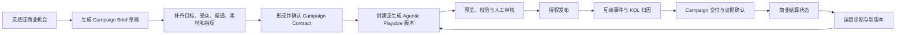

# Airvana 创作者中心「创作灵感与商业机会」结构性需求分析

> 版本：v1.0
> 日期：2026-08-13
> 文档状态：产品结构建议稿；用于确认信息架构和前端范围，不代表生产能力或商业承诺
> 当前实施边界：后端服务暂不开发；第一阶段仅建设前端可验证闭环
> 核心定位：让每一个 KOL 创作并运营属于自己的 Agentic Playable。KOL 是创作者、所有者和运营者；Agentic Playable 是可持续运营的营销智能体。

## 1. 结论先行

抖音截图中最值得借鉴的不是具体图标、配色或“选品带货”等业务，而是它把创作者中心组织成了一个面向行动的工作台：

1. 用创作阶段回答“我现在最应该完成什么”。
2. 用数据摘要回答“过去的创作效果怎么样”。
3. 用创作灵感回答“下一条内容做什么”。
4. 用创作变现回答“哪些机会值得投入时间”。
5. 用卡片级明确动作把浏览直接推进到发布或参与任务。

Airvana 不应直接复制“热点 → 发视频 → 获流量/收入”的链路，而应重构为：

`灵感/商业机会 → Campaign Brief 草稿 → Campaign Contract → Agentic Playable 版本 → 审核与发布 → 互动与归因 → 交付与结算 → 运营优化与资产沉淀`

建议将抖音的“创作变现”在 Airvana 中命名为 **“商业机会”**。在真实 Contract、归因证据和结算账本未接入前，不使用“收益”“已赚取”“预计收入”等会被误解为已验证商业结果的表述。

第一阶段前端应优先完成：

- 创作者阶段与今日行动；
- 创作灵感、商业机会两个主工作区；
- 灵感卡转 Campaign Brief 草稿；
- 商业机会的资格、条件、状态和下一步；
- 我的 Agentic Playables、数据、交付、归因和结算入口的统一串联；
- 全部真实能力、演示数据、待接服务的显式状态区分。

## 2. 分析范围与证据边界

### 2.1 本次输入

- 用户提供的两张抖音创作者中心截图；
- 当前 Airvana 创作者中心页面和本地状态代码；
- 项目既有角色、创作、Campaign、归因与结算需求文档；
- Airvana 已确定的 Campaign Brief、Campaign Contract 和 Agentic Playable 产品边界。

### 2.2 证据分级

| 标记 | 含义 |
| --- | --- |
| 截图可见 | 可直接从用户截图观察到的界面或文案 |
| 产品推断 | 根据页面结构推导出的设计意图，不代表抖音官方说明 |
| 当前已存在 | 当前 Airvana 代码或既有文档中已出现的前端能力 |
| 目标需求 | 本文建议新增或重构的 Airvana 能力 |
| 后端依赖 | 前端可以展示结构，但真实状态必须由后端、第三方或人工审批确认 |

本文不推断抖音的推荐算法、收益规则、准入政策或后端实现，也不把截图中的数字当成可复用业务基准。

## 3. 抖音创作者中心的页面设计思路

### 3.1 截图可见的页面结构

| 层级 | 截图可见模块 | 解决的创作者问题 |
| --- | --- | --- |
| 身份层 | 头像、昵称、账号安全状态、通知、设置 | 我是谁，账号是否具备正常创作条件 |
| 成长层 | 创作阶段、阶段任务、当前进度 | 我现在最该完成哪一步 |
| 结果层 | 7 日播放、7 日净增粉丝、7 日收入 | 最近做得怎么样 |
| 工具层 | 创作灵感、账号检测、数据中心、创作助手、上热门等快捷入口 | 我需要什么工具 |
| 决策层 | 创作灵感 / 创作变现两个主工作区 | 下一步是找选题还是找商业机会 |
| 分类层 | 实时追热、官方活动、粉丝爱看；变现任务、创作基金、内容付费等 | 如何缩小机会范围 |
| 内容层 | 话题卡、任务卡、标签、数量、收藏、筛选 | 这条机会是否适合我 |
| 行动层 | 去发布、立即参与 | 如何立刻进入下一步 |
| 辅助层 | 悬浮创作者助手 | 如何获得上下文指导 |

### 3.2 产品设计意图推断

以下为基于截图的产品推断，而非抖音官方说明：

1. **创作者中心不是资料页，而是任务驾驶舱。** 页面首先展示阶段、指标和下一步，而不是堆放设置项。
2. **灵感与商业机会处于同一决策层。** 两者共享创作者画像、数据和工具，但承担不同任务。
3. **机会以内容流呈现，而非能力清单。** 创作者看到的是“现在可做的事”，不是产品模块目录。
4. **每张卡只推动一个主要动作。** 灵感去发布，商业任务立即参与，降低从判断到行动的距离。
5. **先给摘要，再按需进入详情。** 首页只放少量关键数据和阶段目标，复杂分析进入数据中心。
6. **通过标签解释机会价值。** “高热播放”“高热涨粉”等标签帮助创作者快速判断，但标签是否可信依赖数据来源和口径。
7. **成长机制与商业机制并列。** 新创作者不会直接掉进复杂的收益页面，而是先看到阶段性任务。
8. **助手是跨模块的上下文层。** 助手不占用一个孤立页面，而是在创作者做决策时提供帮助。

## 4. Airvana 应借鉴与不应照搬的部分

### 4.1 建议借鉴

| 抖音机制 | Airvana 映射 | 借鉴价值 |
| --- | --- | --- |
| 创作阶段 | 创作者成长阶段与当前主任务 | 降低第一次创作、第一次 Campaign 交付的理解成本 |
| 数据摘要 | Agentic Playable 7 日运营摘要 | 让数据服务于下一步，而不是单独做报表 |
| 创作灵感流 | 玩法、模板、受众需求、官方 Campaign、优化机会 | 解决“做什么”和“为什么做” |
| 创作变现流 | 商业机会、受邀 Campaign、交付任务、可复用资产机会 | 解决“哪些任务具备明确商业条件” |
| 卡片级 CTA | 生成 Brief、查看 Contract、申请机会、继续交付 | 让机会直接进入工作流 |
| 收藏与筛选 | 收藏灵感、稍后处理、隐藏、不感兴趣、条件筛选 | 支持持续决策而非一次浏览 |
| 创作者助手 | KOL AI 分身/创作助手的受控建议 | 帮助生成 Brief 或优化建议，但不替代审批 |
| 阶段与状态标签 | 草稿、待审核、可发布、运行中、待结算、已完成 | 降低商业流程不透明度 |

### 4.2 不建议照搬

| 不照搬项 | 原因 | Airvana 处理方式 |
| --- | --- | --- |
| 选品带货 | 与 Agentic Playable Campaign OS 的当前定位不一致 | 改为品牌 Campaign、共创、运营服务、可复用资产机会 |
| 直接展示收入数字 | 当前后端和结算证据未形成生产闭环 | 仅显示“待核验/待复核/已确认/已支付”等证据状态 |
| 把流量标签当作保证 | 热度不代表适合特定品牌、地区或转化目标 | 显示来源、时间窗、适配理由和不确定性 |
| 机会卡直接“立即参与” | Campaign 可能受 KYC、地区、品牌资格和容量限制 | 先进行资格判断，再申请或接受 Contract |
| 高频悬浮助手遮挡内容 | 移动端内容密度高，悬浮控件可能挡住卡片和底部操作 | 使用可收起的小入口或页面内助手卡，不遮挡主 CTA |
| 多层横向标签无限扩展 | 小屏下容易出现隐藏入口、误触和理解负担 | 主分类控制在 4–5 个，更多条件进入筛选面板 |
| 用积分奖励替代商业结算 | AIP/AIT、用户权益与 KOL 商业结算属于不同账本 | 三者分区展示，不混合称为收入 |

## 5. 当前 Airvana 创作者中心审计

### 5.1 当前已存在

当前 `public/index.html` 中的创作者中心已包含：

- “Agentic Playable 增长闭环”说明卡；
- Campaign 交付中心；
- 今日推荐任务；
- Agent 运营、效果归因、商业结算三个运营入口；
- 待处理事项与进度；
- 我的 Agentic Playables、Campaign Contract、审核发布、连接器等关联入口。

这说明项目已经具备创作与商业闭环的基础模块，不需要重新发明一套独立业务。

### 5.2 当前结构断点

| 断点 | 当前表现 | 影响 |
| --- | --- | --- |
| 缺少创作者首页摘要 | 先展示抽象增长闭环和功能入口 | 无法快速判断账号状态、阶段、数据和最重要任务 |
| 灵感与任务混合 | “今日推荐任务”和待处理事项承担多个目的 | 创作选题、商业机会、履约待办没有清晰区分 |
| 缺少灵感工作区 | 没有模板、玩法、受众需求、趋势、优化机会的统一列表 | 创作者仍需先想清楚做什么，再进入创作器 |
| 商业机会不完整 | 当前更偏已有 Campaign 的交付入口 | 缺少发现、资格判断、申请、受邀、接受的上游流程 |
| 推荐缺少解释 | 任务卡未说明来源、适配理由和数据时间窗 | 难以建立信任，也不利于屏蔽无关建议 |
| 数据与行动断开 | 归因和结算在运营工作台中独立存在 | 数据没有直接生成优化建议或下一版本任务 |
| 状态证据混杂 | 本地演示数据与未来真实商业状态容易视觉接近 | 用户可能把演示当成真实参与、转化或收入 |
| 助手角色未收敛 | AI 分身、Agent 运营、创作辅助分散在不同入口 | 不清楚助手能建议什么、不能执行什么 |

## 6. 目标产品定义

Airvana 创作者中心应定义为：

**面向 KOL 的 Agentic Playable 创作、商业合作与持续运营驾驶舱。它把灵感、Brief、Contract、创作、审核、发布、数据、归因、交付和结算组织成可继续、可解释、可追踪的任务链。**

它不是：

- 普通个人主页；
- 功能入口大全；
- 没有证据来源的热点榜；
- 未经合同确认的赚钱任务大厅；
- 允许 AI 自动改合同、自动发布或自动结算的控制台。

## 7. 核心用户问题

创作者中心首页必须在一屏到两屏内回答：

1. 我的创作者资格和账号状态是否正常？
2. 我目前处于哪个阶段，今天最重要的任务是什么？
3. 我的 Agentic Playables 最近表现如何？
4. 现在有哪些适合我的创作灵感？
5. 现在有哪些符合资格的商业机会？
6. 我有哪些草稿、审核、交付、归因或结算事项需要处理？

## 8. 目标信息架构

### 8.1 创作者中心首页

```text
创作者中心
├─ 创作者身份与资格状态
├─ 当前阶段 / 今日主任务
├─ 7 日运营数据摘要
├─ 快捷入口
│  ├─ 我的 Agentic Playables
│  ├─ Campaign 交付
│  ├─ 数据中心
│  ├─ 发布与治理
│  └─ 创作助手
└─ 主工作区
   ├─ 创作灵感
   └─ 商业机会
```

### 8.2 创作灵感分类

第一阶段建议控制为五类：

1. **为你推荐**：结合创作者偏好、已有作品和本地演示规则生成的混合列表。
2. **官方 Campaign**：平台或品牌提供的已审核主题；未接后端时只能标记为示例。
3. **玩法与模板**：互动机制、主题、视觉和结构模板。
4. **受众需求**：来自评论、消息、搜索或粉丝反馈的需求；无真实数据时显示空状态，不伪造。
5. **优化机会**：基于已有 Agentic Playable 的漏斗或质量问题生成下一版本建议。

### 8.3 商业机会分类

第一阶段建议按状态而非“赚钱方式”分类：

1. **推荐机会**：满足基础可见条件、尚未申请。
2. **受邀**：品牌或平台定向邀请。
3. **已申请**：等待资格或品牌审核。
4. **进行中**：已接受 Contract，进入创作或交付。
5. **待处理**：待补材料、待审核、待归因、待结算复核。
6. **已完成**：交付、证据和结算状态已闭合，可复制资产。

机会类型可作为二级筛选：品牌 Campaign、联合共创、运营服务、模板/资产合作。后两类在授权和结算机制未确定前只保留为未来能力，不进入第一阶段真实文案。

## 9. Airvana 创作者闭环



关键边界：

- 灵感卡只能生成 Brief 草稿，不能直接生成生产 Campaign。
- 商业机会只有在资格判断和 Contract 确认后才能进入交付。
- 生成完成不等于审核通过，审核通过不等于已发布。
- CTA 点击不等于注册、KYC、购买或其他已确认转化。
- 结算状态必须来自 Contract、归因证据和权威账本，前端不得自行计算成真实应收。

## 10. 详细功能需求

### 10.1 创作者身份与资格卡

| ID | 需求 | 第一阶段行为 |
| --- | --- | --- |
| CC-OV-001 | 显示头像、名称、创作者状态 | 使用当前本地身份状态；明确“本地演示” |
| CC-OV-002 | 分开显示账号、创作者、KYC、商业权限 | 不用一个“已认证”覆盖全部资格 |
| CC-OV-003 | 状态异常时给出修复入口 | 进入身份认证、账号安全或申诉页面 |
| CC-OV-004 | 只读查看不自动授予权限 | 角色视角切换不得改变 entitlement |

### 10.2 创作者阶段与今日行动

阶段建议：

`完成创作者资料 → 创建首个 Brief → 完成首个 Agentic Playable → 通过首次审核 → 首次发布 → 首次有效互动 → 首次 Campaign 交付 → 持续运营`

要求：

- 每次只突出一个主阶段和一个主要动作；
- 显示完成条件、当前进度和为什么需要完成；
- 阶段完成由可验证状态驱动；第一阶段使用本地状态时必须显示“演示进度”；
- 成熟创作者不再长期看到“发布首个作品”，而应看到当前 Campaign、待优化版本或待交付事项。

### 10.3 数据摘要

默认显示 3–4 个与 Agentic Playable 运营直接相关的指标：

| 指标 | 建议口径 | 无数据处理 |
| --- | --- | --- |
| 7 日有效开始 | 去重后的 `play_start` | 显示 `—` 和“暂无可验证数据” |
| 7 日完成率 | `play_complete / play_start` | 不用虚构百分比填充 |
| 7 日 CTA 点击 | 经事件规则验证的 `cta_click` | 不命名为转化 |
| 已确认成功事件 | 经批准外部系统确认的事件 | 后端未接时显示“待接入” |

可选运营指标：运行中的 Playable 数、待审核版本数、待交付 Campaign 数。

商业结算不放在通用数据摘要中直接展示金额。只有真实结算服务接入后，才可单独显示“待确认、待支付、已支付”，并提供币种、时间窗和证据来源。

### 10.4 创作灵感列表

每张灵感卡至少包含：

- 来源类型：官方、模板、受众需求、作品诊断或平台推荐；
- 标题与一句话说明；
- 为什么推荐给我；
- 适合的目标、受众或玩法；
- 数据或判断的时间窗；
- 预计所需素材与制作复杂度；
- 适用地区、语言和风险提示；
- 收藏、隐藏、不感兴趣；
- 主动作：`生成 Brief 草稿` 或 `优化现有 Playable`。

第一阶段交互：

1. 点击卡片打开详情抽屉或通屏页面。
2. 点击“生成 Brief 草稿”预填标题、目标、玩法、来源和待补字段。
3. 所有预填字段允许 KOL 编辑，但保留灵感来源。
4. 缺失目标、受众、渠道、CTA、素材或指标时标记“待补充”，不自动编造。
5. 保存后进入“我的 Brief 草稿”，并可继续进入现有创作流程。

### 10.5 商业机会列表

每张商业机会卡至少包含：

- 品牌/发起方及认证或审核状态；
- Campaign 名称、目标和内容类型；
- 目标地区、语言、时间和截止日期；
- 适合的受众、玩法和交付物；
- KOL 资格：创作者状态、KYC、地区、能力、档期；
- 合同状态：未开放、可申请、受邀、待确认、已锁定；
- 结算方式是否已定义，以及“以 Contract 为准”的提示；
- 素材和授权要求；
- 主动作：查看详情、申请、接受邀请、确认 Contract、继续交付。

前端第一阶段必须支持四种资格结果：

| 状态 | 行为 |
| --- | --- |
| 可申请 | 显示申请动作和所需材料 |
| 条件未满足 | 显示具体缺少的资格及修复入口 |
| 待人工确认 | 允许保存，不声称已参与 |
| 不适用 | 显示地区、年龄、合规或能力原因，不提供绕过入口 |

禁止：

- 用“立即赚钱”“保底收益”“完成即到账”作为机会文案；
- 没有 Contract 就展示确定金额、归因规则或结算承诺；
- 未通过资格判断就直接创建可发布的商业 Playable；
- 把 AIP/AIT 余额混入 KOL 商业收入。

### 10.6 机会详情页

详情页统一分为：

1. 机会摘要；
2. 为什么推荐；
3. Campaign 目标与成功事件；
4. 目标用户、地区和渠道；
5. 玩法与交付物；
6. 素材与授权；
7. CTA、奖励、归因和结算状态；
8. 资格结果；
9. 时间线；
10. 主动作和次动作。

当字段尚未确认时显示 `待品牌确认`、`待平台确认`、`待人工录入` 或 `后端未接入`，不使用看似真实的占位值。

### 10.7 我的 Agentic Playables

统一生命周期：

`草稿 → 待审核 → 可发布 → 运行中 → 待结算 → 已完成 → 可复制`

要求：

- 一个 KOL 可拥有并运营多个 Agentic Playable；
- 每个 Agentic Playable 可拥有多个持续迭代版本；
- 品牌、核心目标、主要结算指标、目标地区、主要受众或新商业 Campaign 变化时创建新的 `playable_id`；
- 文案、视觉、难度、玩法细节、CTA 时机等允许范围内的变化创建新版本；
- 完成后的作品保留版本、事件、归因、结算和运营学习，不直接删除商业证据。

### 10.8 创作助手 / KOL AI 分身

允许：

- 解释机会和资格要求；
- 从灵感生成 Campaign Brief 草稿；
- 提示缺失字段；
- 基于数据提出可验证的优化假设；
- 生成受限的 `KOLCreativePatch` 建议；
- 帮助比较版本差异。

不允许：

- 编造品牌批准、热点数据、收益或转化结果；
- 修改预算、奖励、CTA 地址、地区、声明、归因、结算、数据策略或 Kill Switch；
- 代表 KOL 自动申请、签约、发布、花费、外发或结算；
- 在没有证据时把相关性描述为因果结论。

建议助手使用页面内可收起入口；展开后明确显示“建议，不会自动提交或发布”。

## 11. 核心对象与前端字段

### 11.1 `CreatorStage`

```text
stage_id
title
description
progress_current
progress_target
evidence_type
evidence_status
primary_action
demo_state
```

### 11.2 `InspirationOpportunity`

```text
inspiration_id
source_type
source_label
source_time_window
title
summary
recommendation_reason
objective_tags[]
audience_tags[]
mechanic_tags[]
required_assets[]
region_tags[]
risk_tags[]
evidence_status
saved_state
dismissed_state
```

### 11.3 `CommercialOpportunity`

```text
opportunity_id
campaign_id?
brand_id?
brand_verification_state
title
objective
target_regions[]
languages[]
deadline
deliverables[]
eligibility_requirements[]
eligibility_decision
contract_state
commercial_terms_state
attribution_state
settlement_state
evidence_status
```

### 11.4 `BriefDraft`

必须至少包含：

```text
brief_id
source_inspiration_id?
source_opportunity_id?
objective
primary_success_event
audience
regions
channels
brand_assets
core_mechanic
cta
reward_rules
compliance_constraints
measurement
unknown_fields[]
draft_status
```

## 12. 状态与权限规则

### 12.1 商业机会状态机

`可见 → 已收藏 → 已申请/受邀 → 资格审核 → Contract 待确认 → Contract 已确认 → 创作中 → 待交付 → 审核中 → 已批准 → 运行中 → 待结算 → 已完成`

异常状态必须独立显示：

- 资格不满足；
- 申请被拒绝；
- 待补材料；
- Contract 变更待确认；
- 审核驳回；
- 发布暂停；
- 归因证据缺失；
- 结算争议；
- Campaign 取消或归档。

### 12.2 权限优先级

`平台/品牌批准的 Campaign Contract > KOL 输入 > 模板默认值 > AI 建议`

默认锁定：

- 商业预算；
- 奖励类型、价值、资格和库存；
- CTA 目的地；
- 包含/排除地区和最低年龄；
- 合规声明与禁止声明；
- 数据采集与保留；
- 主要成功事件；
- 归因模型、窗口和优先级；
- 结算事件与规则；
- 审批人、发布权限和 Kill Switch。

## 13. 推荐与排序原则

第一阶段不做算法推荐，只使用可解释的前端规则：

1. 当前阶段的必做事项优先；
2. 已受邀、即将截止、待补材料优先；
3. 与创作者已选领域、语言和玩法匹配的灵感优先；
4. 能优化已有 Playable 明确漏斗问题的建议优先；
5. 地区、资格或合规不满足的机会不进入“可申请”，但可在详情解释原因；
6. 被隐藏或标记不感兴趣的卡片降级或移除；
7. 每张卡展示“为什么推荐给你”。

未来接推荐服务后，仍必须保留：来源、时间窗、推荐原因、资格判断和反馈机制。

## 14. 数据与指标体系

### 14.1 创作者中心产品指标

| 环节 | 建议指标 |
| --- | --- |
| 灵感发现 | 灵感详情打开率、收藏率、隐藏率 |
| 灵感到创作 | 灵感 → Brief 草稿转化率、Brief 补全率 |
| 商业机会 | 详情打开率、资格满足率、申请率、受邀接受率 |
| 生产效率 | Contract 确认到首个预览耗时、草稿恢复率 |
| 质量 | 首次审核通过率、驳回原因分布、发布失败率 |
| 运营 | 开始率、有效互动率、完成率、CTA 点击率 |
| 商业 | 已确认成功事件、交付批准率、结算处理时长 |
| 优化 | 诊断建议采纳率、新版本相对基线变化 |

每个比率必须定义分子、分母、时间窗、排除规则和数据来源。

### 14.2 第一阶段数据原则

- 能从当前本地对象计算的，显示“本地演示数据”；
- 无来源的数据使用 `—`、空状态或“待接入”；
- 示例卡片统一加“示例/演示”标签；
- 不生成虚假的播放量、涨粉、转化、收入或品牌邀请；
- 本地埋点只用于验证交互，不作为真实商业效果证据。

## 15. 第一阶段：无后端前端闭环范围

### 15.1 必须完成

1. 重构创作者中心首页信息层级。
2. 增加创作者阶段、今日主任务和资格摘要。
3. 增加 7 日数据摘要及空状态/演示状态。
4. 增加“创作灵感 / 商业机会”双主工作区。
5. 提供分类、搜索、筛选、收藏、隐藏和不感兴趣。
6. 灵感卡可生成本地 Campaign Brief 草稿。
7. Brief 草稿可继续进入当前 Agentic Playable 创作流程。
8. 商业机会卡展示资格、Contract、交付、归因和结算状态，不伪造真实申请成功。
9. 统一串联我的 Playables、Campaign 交付、数据中心、发布治理和助手。
10. 本地状态刷新后可恢复；删除本地草稿前必须二次确认。
11. 适配浅色/暗黑模式、360/390/430 宽度、键盘和安全区。
12. 弹窗、抽屉和底部操作不被系统导航栏或底部栏遮挡。

### 15.2 第一阶段明确不做

- 真实品牌机会抓取和推荐算法；
- 真实申请、邀请、签约或电子签署；
- 真实收益预测、财务余额或支付；
- 真实 KYC、外部转化确认和结算；
- AI 自动外发、自动发布或自动优化生产版本；
- 外部渠道 OAuth 与发布；
- 素材授权、版权交易或模板分成结算。

### 15.3 第一阶段页面建议

| 页面 | 必要模块 |
| --- | --- |
| 创作者中心首页 | 身份状态、阶段、数据摘要、快捷入口、双主工作区 |
| 创作灵感列表 | 分类、筛选、机会卡、收藏/隐藏、生成 Brief |
| 灵感详情 | 来源、推荐理由、适配信息、素材需求、风险、生成 Brief |
| 商业机会列表 | 状态分类、类型筛选、资格标签、截止时间、主动作 |
| 商业机会详情 | Campaign 摘要、资格、Contract 状态、时间线、下一步 |
| 我的 Brief 草稿 | 来源、完成度、待补字段、继续创作、删除确认 |
| 我的 Agentic Playables | 生命周期、版本、数据、交付、复制 |

## 16. 后续后端与外部依赖

| 能力 | 真实依赖 |
| --- | --- |
| 灵感推荐 | 推荐服务、内容/模板索引、反馈数据和可解释排序 |
| 受众需求 | 评论、消息、搜索和粉丝关系的权威数据 |
| 商业机会 | 品牌组织、Campaign、邀请、申请、资格和审核服务 |
| Brief/Contract | 版本化对象、锁定字段、变更审批、签署和审计 |
| AI 创作 | Agent Task、模型路由、队列、失败恢复、配额和成本 |
| 素材 | 对象存储、扫描、授权证据、CDN 和生命周期 |
| 数据中心 | 统一事件、去重、防刷、同意状态、归因和报表 |
| 商业结算 | KYC、合同、Deliverable、证据、财务审批和权威账本 |
| 外部分发 | OAuth/Bot、Token Vault、渠道回调、重试和撤权 |

## 17. 优先级建议

### P0：先完成结构与本地前端闭环

- 创作者首页重构；
- 创作灵感/商业机会双工作区；
- 灵感 → Brief 草稿；
- 机会资格与状态解释；
- 我的 Playables 和待办统一；
- 数据来源与演示标识；
- 移动适配、暗黑模式、空/错/加载状态。

### P1：接当前本地服务

- Brief、Contract、内容、Task、审核、版本、Campaign、归因和结算状态统一接线；
- 加载失败、重试、取消、刷新恢复和幂等；
- 同一批对象贯穿创作与交付。

### P2：外部与生产能力

- 品牌组织与真实机会；
- KYC、电子签署、渠道连接器；
- 外部转化确认和归因证据；
- 商业结算、争议和审计；
- 推荐服务、实验、灰度和回滚。

## 18. 第一阶段验收标准

### 18.1 结构验收

- 用户进入创作者中心后，无需打开抽屉即可看见阶段、数据摘要、灵感和商业机会。
- “创作灵感”和“商业机会”是同层主工作区，切换后状态和滚动位置可预期。
- 快捷入口不与主工作区重复堆叠相同能力。
- 现有 Campaign 交付、归因、结算、Agent 运营入口全部保留并重新归位。

### 18.2 功能验收

- 灵感支持分类、筛选、收藏、隐藏和生成 Brief 草稿。
- Brief 草稿明确显示预填字段、来源和待补字段。
- 商业机会支持资格状态、原因、下一步和时间线。
- 未接后端时，“申请、接受、签约、发布、转化、结算”均不能伪装为真实成功。
- 页面刷新后本地草稿、收藏、隐藏和筛选状态可恢复。
- 删除草稿、取消申请演示状态、移除收藏等破坏性动作具备确认或可撤销机制。

### 18.3 视觉与移动验收

- 360、390、430 像素宽度无横向溢出和文字截断关键含义。
- 视觉紧凑控件保持 28–32 像素视觉尺寸，通过透明命中区满足触控要求。
- 浅色和暗黑模式下卡片、标签、分割线、输入框、弹窗与状态颜色可读。
- 底部固定操作、抽屉和弹窗尊重安全区，不被系统导航栏或 APP 底栏遮挡。
- 悬浮助手收起时不遮挡卡片主按钮，展开时可清晰关闭。

### 18.4 业务边界验收

- KOL 与 Agentic Playable 角色表述不混淆。
- Campaign Brief 先于 Campaign Contract，Contract 先于生产交付。
- 生成、审核、发布、转化和结算使用不同状态。
- AIP、AIT 和 KOL 商业结算分开显示。
- 预算、奖励、CTA、地区、声明、归因、结算、数据策略和 Kill Switch 不允许由 AI 或 KOL 绕过。

## 19. 待产品确认的关键决策

1. 是否确认前台主标签使用“商业机会”，不使用“创作变现”。本文建议确认。
2. 第一阶段商业机会是否只展示“品牌 Campaign”，暂不展示模板分成、素材授权和运营服务。本文建议只做品牌 Campaign。
3. 创作者阶段是否以“首个 Brief—首个 Playable—首次审核—首次发布—首次交付”为主线。本文建议确认。
4. 当前本地 `quests` 页面是否直接重构为新创作者中心，而不是新增第二套页面。本文建议直接重构，避免双入口和状态分叉。
5. 第一阶段数据是否统一使用“本地演示/暂无数据/待接入”，完全移除无来源的业务数字。本文建议确认。

## 20. 推荐实施顺序

1. 先确认命名、信息架构、阶段模型和第一阶段数据边界。
2. 重构当前创作者中心首页，不新增平行页面。
3. 完成创作灵感列表、详情和 Brief 草稿。
4. 完成商业机会列表、详情和资格状态。
5. 串联我的 Playables、Campaign 交付、数据、审核、归因和结算入口。
6. 补齐本地恢复、空/错/加载、删除确认、暗黑模式和移动适配。
7. 完成前端验收后，再决定本地服务接线顺序；后端服务暂不开发。
