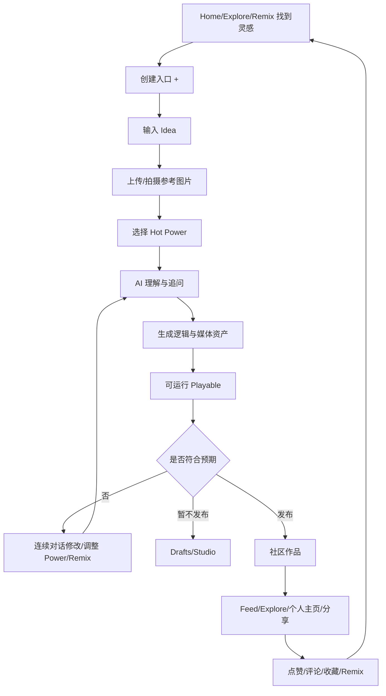
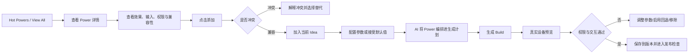
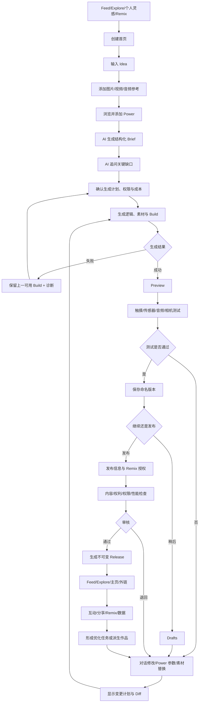

# Loopit 完整创作流程、Power 能力与发布全链路产品需求文档

> 版本：v1.0  
> 调研日期：2026-08-18  
> 文档状态：竞品事实调研 + 产品推断 + 对标需求建议，不代表 Loopit 官方说明，也不代表本项目已实现  
> 研究对象：SeedLeap Intelligent Technology Co., Ltd. 开发的 Loopit - Make Playables  
> 覆盖范围：Idea、参考素材、Power、AI 多轮创作、资产生成、预览、修改、草稿、审核、发布、Feed、分享、Remix 与发布后运营  
> 参考原则：研究产品机制，不复制 Loopit 的品牌、界面、素材、文案、代码或其他受保护内容。

---

## 1. 结论先行

Loopit 的核心创作闭环可以概括为：

`Idea/图片参考 → 选择 Power → AI 理解并追问 → 生成逻辑与素材 → 试玩 → 连续对话修改 → 草稿 → 发布 → Feed/主页/分享 → Remix`

本轮研究可以确认：

1. Loopit 是一个 AI 互动内容平台，用户通过自然语言创建 Playable，不要求编程或设计技能。[Loopit 中文官网](https://loopit.com.cn/about) [Google Play](https://play.google.com/store/apps/details?id=com.seedleap.loopitapp&hl=en-US)
2. 官方中文介绍明确称 Loopit 能在同一创作上下文中理解长文本、图片参考和连续修改指令，平均约三轮对话生成一个作品。[Loopit 中文官网](https://loopit.com.cn/about)
3. 官方公开能力包括生成图片/GIF、视频、音乐/音效，以及把触摸、滑动、倾斜、摇晃、麦克风和摄像头等手机输入变成互动玩法。[Loopit 中文官网](https://loopit.com.cn/about) [Google Play](https://play.google.com/store/apps/details?id=com.seedleap.loopitapp&hl=en-US)
4. 官方 Google Play 截图可见 `Hot Powers`、`View All`、带 `+` 的 Power 卡片；可识别的卡片包括 `Interactive Fluid Background` 和 `Shadow Effect`。这能确认 Power 是创作入口中的显式能力，但官方公开文字尚未定义其内部对象、参数、权限和版本结构。[Google Play](https://play.google.com/store/apps/details?id=com.seedleap.loopitapp&hl=en-US)
5. 同一组官方截图可见：Prompt 输入、多个图片参考、相机/图库等工具、Remix 推荐、Explore、Drafts/Studio、个人主页和 Feed 中的 Remix/互动动作。[Google Play](https://play.google.com/store/apps/details?id=com.seedleap.loopitapp&hl=en-US)
6. Loopit 服务条款确认发布后的 Created Content 会对社区可见，其他用户可能查看、互动和 Remix，原作者应获得署名；平台可使用自动化和人工方式进行内容审核。[Loopit Terms](https://app.loopit.me/terms)
7. 公开资料不足以确认：Power 详情页和完整分类、Power 是否可由用户创建、精确预览界面、版本对比、Undo/回滚、私密发布、发布审核过程、素材版权检查和生成成本规则。

因此，本文件使用三层结构：

- **事实层**：官网、应用商店、官方截图、条款和隐私政策可以直接支持的内容；
- **推断层**：根据界面关系推导，但仍需要真机核实的产品逻辑；
- **需求层**：建议本项目参考 Loopit 建设的完整可控创作和发布系统。

---

## 2. 调研目标与非目标

### 2.1 调研目标

- 还原 Loopit 从发现灵感到创建、预览、发布和 Remix 的主流程；
- 重点解释 Power 在创作流程中的作用、可见能力和待确认边界；
- 梳理图片/GIF、视频、音乐/音效和手机传感器能力；
- 形成可交给产品、设计、前端、后端、AI、QA、审核和运营团队的全链路 PRD；
- 为 Airvana 的 Agentic Playable 创作器提供可复用结构，但不把 Loopit 的消费者产品规则直接搬入商业 Campaign。

### 2.2 非目标

- 不反向工程 Loopit 的源代码、模型、提示词、推荐算法或服务端；
- 不将第三方文章或用户评论写成 Loopit 官方事实；
- 不把“Hot Powers”截图直接解释为开放插件市场、用户自定义代码或商业 API；
- 不把“可生成视频/音乐”自动解释为专业视频编辑器或 DAW；
- 不在没有真机证据时宣称 Loopit 支持私密发布、版本回滚、多人协作或 Power 参数面板；
- 不把本文件中的推荐功能表述为当前项目已经上线。

---

## 3. 证据分级

| 等级 | 定义 | 使用方式 |
| --- | --- | --- |
| S | Loopit 官方官网、应用商店、官方商店截图、条款和隐私政策 | 可写为“当前公开可确认” |
| A | 公司或开发者公开口径、官方渠道说明 | 标记为“官方口径”，仍需产品内复核 |
| B | 独立媒体实测、第三方应用评测和用户评价 | 仅用于发现流程、限制和风险 |
| C | 根据截图、导航关系和行业惯例作出的推断 | 必须明确标记为“产品推断” |
| P | 本文提出的产品需求和治理建议 | 不得写成 Loopit 现有能力 |

### 3.1 当前关键事实矩阵

| 能力 | 判断 | 证据与限制 |
| --- | --- | --- |
| 自然语言 Idea 创建 | 已确认 | 官网与商店均说明描述想法即可生成 |
| 长文本与连续修改 | 已确认 | 中文官网明确说明同一上下文理解长文本与连续指令 |
| 图片参考 | 已确认 | 中文官网说明图片参考；官方截图出现多个图片附件 |
| 平均三轮对话 | 官方口径 | 中文官网明确表述，不代表所有作品都固定三轮 |
| AI 生成逻辑与艺术 | 已确认主张 | 商店说明 AI 生成 logic、art、interaction |
| 图片/GIF | 已确认官方能力 | 中文官网列出 |
| 视频 | 已确认可作为生成素材包能力 | 具体生成/上传/编辑/输出路径未公开 |
| 音乐/音效 | 已确认官方能力 | 具体曲库、上传、授权和事件绑定未公开 |
| 触摸/滑动 | 已确认 | Google Play 描述和 Playable 定位支持 |
| 倾斜/摇晃/重力 | 已确认 | 中文官网和 Google Play 支持 |
| 麦克风吹气/声控/音量/音高 | 已确认官方表述 | 权限、阈值、降噪与隐私路径未公开 |
| 摄像头 AR/人脸/手势 | 已确认官方表述 | 前后摄像头权限、处理位置和回退不明 |
| OCR | 待核实 | 中文官网把 OCR 列在麦克风条目中，分类存在明显疑点，不应据此推断“麦克风 OCR” |
| Hot Powers | 已确认界面存在 | 官方截图出现卡片、`+` 和 View All |
| Power 是可附加模块 | 高可信产品推断 | 卡片的 `+` 位于 Prompt 下方，但完整添加后的状态未公开 |
| Power 允许用户创建 | 未确认 | 没有可靠公开证据 |
| Power 参数面板 | 未确认 | 没有可靠公开证据 |
| Remix | 已确认 | 商店、截图与条款均支持 |
| Drafts | 已确认界面存在 | 官方截图展示 Drafts 网格 |
| Preview/试玩 | 已确认核心行为 | Playable 必须能运行，官方要求用户验证 AI 输出；具体 Preview 页面未公开 |
| 发布到社区 | 已确认 | 商店说明可发布，条款定义公开可见与 Remix |
| 发布可见性选项 | 未确认 | 条款说明“选择发布后”对社区可见，未公开 Private/Unlisted 等 UI |
| 自动 + 人工审核 | 已确认政策能力 | 条款确认平台可组合使用自动工具和人工审核 |
| 版本/Undo/回滚 | 未确认 | 没有足够公开证据 |
| Credits/Coins | 存在公开迹象但规则冲突 | 商店页面显示应用内购买，评论提到 Credits/Coins；同时官方描述称 Free/No limits，不能据此确定价格和消耗规则 |

---

## 4. Loopit 产品结构

### 4.1 产品定位

Loopit 将 Playable 定义为一种可被触摸、操作、反馈和 Remix 的社交内容形态，而不是传统意义上的完整游戏项目。官方列举的内容包括互动梗图、ASMR 玩具、小游戏、谜题、互动艺术和模拟体验。[Google Play](https://play.google.com/store/apps/details?id=com.seedleap.loopitapp&hl=en-US) [App Store](https://apps.apple.com/us/app/loopit-ai-playable-maker/id6755859360)

其产品对象可以抽象为：

```text
Playable
├─ Idea 与连续创作上下文
├─ Power 能力组合
├─ 互动逻辑
├─ 图片/GIF/视频/音乐/音效资产
├─ 运行时权限与传感器输入
├─ 可运行构建
├─ 作者与发布记录
├─ 社区互动
└─ Remix 来源关系
```

### 4.2 官方截图可观察的信息架构

| 区域 | 可观察内容 | 结论 |
| --- | --- | --- |
| Home/Feed | 全屏 Playable、点赞、评论、收藏、拍摄/记录、分享、Remix | 消费、互动和二创处于同一页面 |
| 创建首页 | Prompt、图片参考、相机/图库/能力图标、发送按钮 | 创作从自然语言和多模态参考开始 |
| Hot Powers | Power 卡片、`+`、View All | Power 是创建入口中的可选能力层 |
| Remix 区 | 可复用作品卡片 | 创建首页同时承担灵感和二创入口 |
| Explore | Play、Following、Latest、Whimsy、搜索、作品网格 | 发现不是单一推荐流 |
| Drafts/Studio | 草稿网格 | 创作结果可保存并继续处理 |
| Me | 个人资料、Following、Followers、Likes & Saves、Posts/Likes/Saved | 作品与社交资产归属个人主页 |

> 注意：官方不同截图中同一底部入口曾显示 `Studio` 或 `Drafts`，可能来自不同版本或营销合成。本文不据此断言当前导航文案固定。

### 4.3 Loopit 的内容循环



---

## 5. Loopit 当前创作流程拆解

### 5.1 阶段一：发现 Idea

**可观察入口**

- Home 全屏 Feed；
- Explore 的 Play、Following、Latest、Whimsy 和搜索；
- 创建首页的 Remix 推荐；
- 个人主页的 Posts/Likes/Saved；
- 外部分享链接；
- 生活中的一句话、热梗、截图、食物、表情、情绪或动作。

**产品作用**

- 用户不需要先进入“专业编辑器”才能理解平台能做什么；
- Feed 中的每个 Playable 都是可玩内容，也是下一次 Remix 的起点；
- 热门 Power 与热门 Remix 同时为新建提供能力和示例。

### 5.2 阶段二：输入 Idea 和参考素材

官方截图显示创建界面包含：

- 大型自然语言 Prompt 输入；
- 多张图片参考；
- 相机、图库和其他能力入口；
- 发送/生成按钮；
- Prompt 下方的 Hot Powers；
- Remix 推荐区。

示例文案表达了清晰的对象、动作、触发方式和反馈结果。这说明高质量 Idea 至少应包含：

```text
对象：谁或什么
触发：用户做什么
反应：画面/声音/状态发生什么
目标：是玩具、梗图、挑战、谜题还是模拟
素材：是否使用参考图、音乐、视频或角色
```

### 5.3 阶段三：选择 Power

#### 可确认事实

- 创建首页存在 `Hot Powers`；
- 有 `View All`；
- 每张 Power 卡有 `+`；
- 可辨识的卡片包括 `Interactive Fluid Background` 和 `Shadow Effect`；
- 卡片同时显示名称和预览图。

#### 产品推断

Power 很可能是平台预先封装的可复用能力模块，用于将一类视觉效果、互动方式、输入能力或玩法逻辑加入当前 Idea。它可能同时服务于：

- 帮用户发现“可以怎么玩”；
- 降低 Prompt 描述复杂能力的难度；
- 给 AI 一个结构化、可验证的能力约束；
- 复用经过性能和兼容性验证的能力实现；
- 为未来 Power 排行、复用、创作者生态或能力市场奠定对象基础。

#### 当前不能确认

- Power 是否会直接加入 Prompt、加入生成计划还是加入运行时；
- 同一作品可添加多少 Power；
- Power 是否有参数配置；
- Power 是否由平台、AI、创作者或第三方开发；
- Power 是否收费、消耗 Credits 或有设备限制；
- Power 是否可以在发布后升级或撤回。

### 5.4 阶段四：AI 理解与多轮创作

官方中文页明确：

- Loopit 能理解创作者意图并构思玩法；
- 能在同一上下文理解长文本、图片参考和连续修改指令；
- 创作者可以持续调整，不必每次从零开始；
- 平均三轮对话生成一个作品。[Loopit 中文官网](https://loopit.com.cn/about)

因此可确认的产品思想是：

```text
自由表达
→ AI 识别目标、对象、交互和风格
→ AI 补足玩法
→ 生成
→ 用户反馈
→ 在同一上下文中定向修改
```

公开资料没有说明 AI 是否会先展示生成计划、是否显示受影响对象、是否有结构化 Brief 或修改 Diff。

### 5.5 阶段五：生成素材包与互动逻辑

官方称可一键生成：

- 图片/GIF；
- 视频；
- 音乐/音效；
- 互动逻辑；
- 对触摸、滑动、倾斜、声音和摄像头输入的响应。

这里应区分：

- “能够生成素材包”不等于用户可以逐轨、逐帧专业编辑；
- “能够响应摄像头”不等于平台会长期保存原始相机数据；
- “能够使用音乐”不等于所有音乐都获得商业许可；
- “AI 生成完成”不等于已经通过功能、性能、权利和发布审核。

### 5.6 阶段六：预览和试玩

**可以确认**

- 产物是可运行 Playable，而非静态图片或视频；
- 用户必须通过触摸、声音、动作或摄像头实际体验结果；
- 服务条款明确 AI 输出可能不准确、不完整或不适用，用户有责任审查和验证。[Loopit Terms](https://app.loopit.me/terms)

**公开资料不足**

- Preview 是否是独立页面；
- 是否存在 Play/Edit 切换；
- 是否能模拟麦克风、陀螺仪和相机；
- 是否展示权限、错误、事件和性能；
- 是否保存最后一个可运行构建；
- 是否支持 Undo、版本和回滚。

### 5.7 阶段七：连续修改与 Remix

Loopit 的两种迭代方式：

1. **同一作品连续修改**：模型保留上下文，用户不断调整；
2. **Remix**：从社区作品开始，改变规则、视觉或互动，生成自己的派生版本。

官方商店强调 Remix 不需要从零开始；条款说明发布作品可能被其他用户 Remix，并为原作者提供署名。[Google Play](https://play.google.com/store/apps/details?id=com.seedleap.loopitapp&hl=en-US) [Loopit Terms](https://app.loopit.me/terms)

待核实：

- Remix 是否复制全部素材和逻辑；
- 原作者能否关闭 Remix；
- 哪些素材不能进入派生版本；
- 派生作品是否保留原作版本；
- 商业使用和非商业使用是否具有不同许可。

### 5.8 阶段八：草稿

官方截图显示 Drafts 网格，每个草稿以可视缩略图展示。可以确认平台存在“暂存未发布作品”的产品概念。

待核实：

- 自动保存频率；
- 草稿是否跨设备同步；
- 草稿是否包含对话、Power、素材、构建和测试状态；
- 删除草稿的恢复机制；
- Studio 与 Drafts 的关系；
- Credits 不足或生成失败时是否仍保存草稿。

### 5.9 阶段九：发布

**可确认**

- Loopit 支持把完成的 Playable 发布到社区；
- 发布后可进入 Feed、Explore 和个人主页；
- 其他用户可以互动、分享并可能 Remix；
- 平台可进行自动和人工内容审核；
- 删除内容后会立即退出公开可见状态，但备份可能按政策保留。[Loopit Terms](https://app.loopit.me/terms) [Loopit Privacy](https://app.loopit.me/privacy)

**未确认**

- 标题、描述、封面、分类、标签是否必填；
- Private、Unlisted 和 Public 选项；
- Remix 是否能关闭；
- 发布前是否自动试玩或扫描素材权利；
- 审核是同步还是异步；
- 审核失败的原因和申诉路径；
- 发布版本是否不可变；
- 是否支持暂停、撤回和回滚。

### 5.10 阶段十：发布后分发与运营

官方截图和商店描述支持：

- Feed 中即时游玩；
- Explore 搜索与分类；
- 点赞、评论、收藏和分享；
- 关注创作者；
- 个人主页的 Posts/Likes/Saved；
- 一键 Remix；
- 外部分享页打开后引导下载 App。

尚未确认：创作者数据看板、作品分析、版本表现、Remix 血缘图、评论治理、下架和申诉。

---

## 6. Power 能力专项分析

### 6.1 Power 的建议产品定义

基于当前截图，建议把 Power 定义为：

> **可被添加到 Idea/Playable、由 AI 编排、在运行时提供特定交互或视觉能力、具有明确输入、输出、参数、权限、兼容性和版本的复用模块。**

这一定义属于 PRD 建议，不是 Loopit 官方公开定义。

### 6.2 Power 能力分类

| 类别 | 当前公开支持 | 推荐 Power 示例 |
| --- | --- | --- |
| Touch | 点击、滑动 | Tap、Double Tap、Hold、Swipe、Drag、Pinch |
| Motion | 陀螺仪、重力、摇晃、倾斜 | Shake、Tilt Steering、Balance、Motion Parallax |
| Microphone | 吹气、声控、音量、音高 | Blow、Volume Trigger、Pitch Match、Shout Meter |
| Camera | 前后摄像头、AR、人脸、手势 | Face Tracking、Hand Gesture、AR Placement、Object View |
| Visual | Hot Powers 中的视觉能力 | Interactive Fluid Background、Shadow Effect、Particles、Trail |
| Physics | 官方内容示例存在物理互动方向 | Gravity、Collision、Spring、Fluid、Rope、Stacking |
| Media | 图片/GIF、视频、音乐/音效 | Image Animate、Video Layer、Music Reactive、SFX Pack |
| Feedback | 互动内容所需的反馈 | Haptics、Screen Shake、Flash、Success/Fail Feedback |
| Game Loop | AI 构思玩法需要的结构 | Score、Timer、Lives、Combo、Randomizer、Win/Fail |
| Social | 发布后循环 | Share Card、Remix Attribution、Reaction Prompt |

> Touch/Motion/Microphone/Camera/Visual/Media 中部分能力有官方公开依据；Physics、Feedback、Game Loop 和 Social 的模块化方式属于推荐设计。

### 6.3 Power 对象模型

```yaml
power_id: "power_..."
name: "Tilt Steering"
version: "1.2.0"
owner_type: "platform | verified_creator | partner"
category: "motion"
description: "Use device tilt as horizontal control"
preview_asset: "asset_..."
inputs:
  - "device_orientation"
outputs:
  - "normalized_x"
  - "normalized_y"
permissions:
  - "motion"
parameters:
  sensitivity:
    type: "number"
    min: 0.1
    max: 2.0
    default: 1.0
compatibility:
  platforms: ["ios", "android"]
  min_os: {}
  incompatible_powers: []
fallback:
  type: "touch_drag"
  required: true
resource_budget:
  cpu: "medium"
  gpu: "low"
  network: "none"
privacy:
  raw_data_retained: false
  processing: "on_device"
events:
  - "power_started"
  - "power_signal_received"
  - "power_fallback_used"
review_status: "approved"
deprecated_at: null
```

### 6.4 Power Instance

同一个 Power 被添加到不同作品后，应生成 `power_instance`，记录：

- 所属 `project_id`、`version_id`；
- Power 版本；
- 参数值；
- 绑定的场景、对象和事件；
- 权限请求时机；
- 权限拒绝回退；
- 资源预算；
- 测试结果；
- 发布审核状态。

### 6.5 Power 添加流程



### 6.6 Power 详情页必须解释

- Power 做什么；
- 用户如何触发；
- 作品会产生什么反馈；
- 需要哪些系统权限；
- 数据是否离开设备、是否保存；
- 支持的设备和系统版本；
- 无权限或无传感器时如何回退；
- 与哪些 Power 冲突；
- 是否消耗生成额度或运行资源；
- Power 版本、作者、审核和最近更新时间；
- 哪些素材或玩法最适合。

### 6.7 传感器 Power 强制规则

#### Motion

- 权限只在进入需要 Motion 的真实交互时请求；
- Preview 必须有实时校准和重置；
- 提供触摸按钮或拖拽回退；
- 避免要求大幅摇晃造成设备跌落；
- 支持减少动态效果和低活动模式。

#### Microphone

- 请求前说明是吹气、音量、音高还是语音识别；
- 默认不保存原始音频；
- 支持环境噪音校准；
- 吹气和喊叫需要阈值、冷却时间和误触保护；
- 权限拒绝时提供按住/点击等替代；
- 不将背景谈话用于非必要识别或训练。

#### Camera

- 明确前置/后置摄像头、AR、人脸、手势或图像识别用途；
- 未经独立同意不得保存或上传原始画面；
- 人脸、未成年人和身份识别需要更高审核；
- 提供图片上传或触摸回退；
- Preview 必须显示相机安全区、遮挡和前后台恢复。

### 6.8 Power 冲突

系统必须识别：

- 多个 Power 争用同一手势；
- 多个 Microphone Power 使用不同阈值；
- 前后摄像头同时请求；
- 高 GPU 视觉 Power 叠加；
- Motion Power 与系统方向锁定冲突；
- 音乐响应和麦克风响应形成反馈啸叫；
- Power 修改成功/失败条件与基础玩法冲突；
- Power 版本升级导致参数不兼容。

### 6.9 Power 生命周期

```text
draft → reviewing → approved → active → deprecated → disabled
```

- `deprecated`：已有作品继续运行，但新作品不可添加；
- `disabled`：因安全、隐私或严重故障停止运行，必须启用回退；
- 任何 Power 升级不得静默改变已发布 Playable；
- 发布版本必须固定 Power 版本；
- Power 被撤回时要能定位全部依赖作品。

---

## 7. Loopit 设计优势与当前公开缺口

### 7.1 值得借鉴

| 设计 | 产品价值 |
| --- | --- |
| Idea-first | 用户先表达目标，不先学习编辑器 |
| 图片参考 | 把现实素材和个人内容直接带入创作 |
| Hot Powers | 用能力示例告诉用户“还能怎么玩” |
| AI 连续上下文 | 作品可持续修改而非每次从零生成 |
| 多模态素材包 | 一次生成逻辑、画面、声音和动态媒体 |
| 手机原生输入 | Playable 与普通 H5 点击游戏形成差异 |
| Drafts | 支持未完成创作和多作品管理 |
| Feed 即运行环境 | 用户在内容流中直接互动，不必离开应用 |
| Remix | 作品同时是内容，也是下一次创作模板 |

### 7.2 需要重点核实或补齐

| 缺口 | 风险 | 推荐补齐 |
| --- | --- | --- |
| Power 内部规则不透明 | 用户不知道权限、成本和限制 | Power Detail + Manifest |
| AI 修改范围不可见 | 连续修改可能误改已有内容 | 生成计划、Diff、检查点 |
| Preview 工具公开信息少 | 传感器和权限问题难以及时发现 | 真实设备 Preview + 模拟/诊断 |
| 素材权利信息不可见 | 发布和 Remix 可能造成侵权 | Asset Manifest + Licence Gate |
| 版本治理不清 | AI 失败或 Power 升级可能破坏作品 | 不可变版本、回滚和依赖锁定 |
| 发布权限不清 | 用户可能不知道发布即允许社区 Remix | 发布前明确可见性和 Remix 授权 |
| Credits 表述冲突 | 用户无法预期生成成本 | 提交前显示消耗、失败退还和余额 |
| 审核状态不可见 | 发布失败或下架原因不透明 | 自动检查、人工审核、申诉状态 |
| 设备无能力时回退不清 | Power 在不同手机上不可玩 | Compatibility + Fallback |
| 数据声明存在不一致风险 | 商店数据声明与隐私政策需要持续对齐 | 数据清单、权限账本和商店声明审计 |

---

# 需求层：完整创作与发布系统 PRD

## 8. 产品定义

### 8.1 产品名称

**Power-enabled Agentic Playable Studio**

### 8.2 产品愿景

让用户用一句 Idea、参考素材和可复用 Power，在移动端生成一个真正能够响应触摸、动作、声音和摄像头的互动作品；同时保证每次生成、权限、素材、预览、版本、审核、发布和 Remix 都可理解、可测试、可追溯和可回滚。

### 8.3 核心体验

```text
新手：一句话 + 一张图 + 一个 Power → 首个可运行版本
进阶创作者：连续对话 + Power 参数 + 素材替换 → 可控版本
审核者：权限 + 内容 + 权利 + 性能 + 行为 → 可发布结论
参与者：打开即玩 → 互动 → 分享 → Remix
```

### 8.4 产品目标

| 目标 | 建议指标 |
| --- | --- |
| 降低首次创作门槛 | 创建进入到首个可运行 Preview 的完成率 |
| 增强 Power 可发现性 | Power 查看、添加、成功生成和有效使用率 |
| 提高生成可控性 | AI 非预期修改率、恢复率、平均修订轮数 |
| 保证跨设备可玩 | Power 权限通过率、回退成功率、设备兼容失败率 |
| 提高发布成功 | Preview 到发布率、审核一次通过率 |
| 促进创作循环 | 分享率、Remix 启动率、Remix 发布率 |

### 8.5 非目标

- P0 不开放任意第三方代码执行；
- P0 不建设完整 Power 开发者市场；
- P0 不做专业视频剪辑、音乐制作或 3D 引擎；
- 不允许 AI 自动授予相机/麦克风权限；
- 不允许 AI 自动改变商业 CTA、奖励、结算、地区和合规字段；
- 不用具体模型名称作为用户侧 Power。

---

## 9. 用户角色与权限

| 角色 | 目标 | 权限 |
| --- | --- | --- |
| 玩家 | 游玩、反馈、分享 | 运行已发布作品和社区互动 |
| 新手创作者 | 快速生成作品 | Idea、参考素材、已审核 Power、Preview、草稿 |
| 进阶创作者 | 精细调整和测试 | Power 参数、素材、版本、测试、发布申请 |
| Remix 创作者 | 基于原作二创 | 仅复制被授权的结构、Power 和素材 |
| Power 维护者 | 创建和维护复用能力 | 提交 Manifest、测试、升级；不能直接上线 |
| 审核者 | 审核内容、权限和权利 | 批准、退回、拒绝；不能改作品内容 |
| 运营者 | 发布、暂停和回滚 | 操作 release；不能伪造作者或审核 |

### 9.1 权限边界

- Power 开发和 Power 使用必须分开授权；
- Power 可修改玩法参数，但不可修改账号、支付、发布审批和平台政策；
- Camera/Microphone/Motion 权限只由用户在运行时明确同意；
- 商业项目的品牌、CTA、奖励、结算、归因和地区必须锁定；
- 已发布版本不可被普通编辑静默覆盖。

---

## 10. 核心对象

| 对象 | 定义 | 关键字段 |
| --- | --- | --- |
| `project` | 一个创作项目 | owner, origin, status, current_version_id |
| `idea_brief` | 结构化创作意图 | object, trigger, reaction, goal, style, audience |
| `conversation` | 多轮创作上下文 | messages, attachments, confirmed_decisions |
| `power` | 可复用能力定义 | inputs, outputs, permissions, params, compatibility, fallback |
| `power_instance` | 某版本中使用的 Power | power_version, params, bindings, test_status |
| `asset` | 图片/GIF/视频/音乐/SFX 等 | source, rights, version, checksum, usage |
| `playable_config` | 可运行作品结构 | scenes, objects, logic, powers, events |
| `build` | 一次生成的可运行产物 | state, artifact, diagnostics, source_version |
| `preview_session` | 一次预览和测试 | device, permissions, sensor_data, results |
| `version` | 可恢复快照 | parent, change_summary, dependencies |
| `draft` | 未发布工作状态 | autosave, sync, latest_build |
| `release` | 不可变发布记录 | version_id, visibility, review, publish_time |
| `remix_relation` | 原作与派生关系 | source_project, source_version, licence, attribution |

---

## 11. 信息架构

```text
Home
├─ 全屏 Playable Feed
├─ 社区互动
└─ Remix

Explore
├─ Play
├─ Following
├─ Latest
├─ 分类/Whimsy
└─ 搜索

Create
├─ Idea Prompt
├─ Camera/Gallery/Assets
├─ Hot Powers
├─ Power Library
├─ Remix Suggestions
└─ Generate

Studio
├─ Chat / Brief
├─ Build / Preview
├─ Powers
├─ Assets
├─ Versions
├─ Test
└─ Publish

Drafts
├─ 草稿网格
├─ 生成中
├─ 需要修复
├─ 待审核
└─ 已发布版本

Me
├─ Profile
├─ Posts
├─ Likes
├─ Saved
└─ Creator Analytics
```

---

## 12. 完整目标流程



---

## 13. 分阶段详细需求

### 13.1 灵感和创建入口

**入口**

- 底部 `+`；
- Feed 的 Remix；
- Explore 作品卡；
- Hot Power 详情的“使用此 Power”；
- Drafts 的继续创作；
- 个人主页新建；
- 外部 Deep Link。

**要求**

- 进入后立即生成本地 `draft_id`；
- 未登录用户可体验到首次 Preview，保存/发布时再要求登录；
- Remix 前显示原作、版本、可复用范围和署名；
- 入口来源写入分析事件，不改变作者归属。

### 13.2 Idea 输入

**P0 输入**

- 自然语言 Prompt；
- 图片参考；
- 拍摄或图库；
- 选择 0–3 个推荐 Power；
- 使用 Remix 作为起点。

**结构化识别**

- `object`：对象；
- `trigger`：用户输入；
- `reaction`：反馈；
- `goal`：体验目标；
- `loop`：可重复核心循环；
- `success/failure`：成功和失败；
- `style`：视觉和声音风格；
- `duration`：目标时长；
- `audience`：受众和语言；
- `reference_assets`：参考素材；
- `selected_powers`：Power 组合。

### 13.3 AI 追问

- 首轮最多询问 1–3 个会显著改变结果的问题；
- 已明确内容不重复询问；
- 为简单玩具和梗图提供快速生成；
- 为游戏补齐目标、控制、反馈、成功、失败和重试；
- 为 Camera/Microphone/Motion Power 明确权限与回退；
- 版权、商业用途、未成年人、外部 CTA、奖励和地区不得用默认猜测；
- 每轮回答写入 Brief 的确定字段，不只留在聊天记录。

### 13.4 Power 推荐与添加

**推荐来源**

- Idea 的触发词；
- 参考图片/视频类型；
- 内容类别；
- 当前设备能力；
- 已选 Power 的兼容性；
- 热门但经过质量和安全过滤的 Power；
- 相似已发布作品。

**卡片信息**

- 名称和效果预览；
- 输入方式和用户动作；
- 权限图标；
- 设备支持；
- 是否需要回退；
- 生成/运行资源级别；
- 添加按钮；
- 已添加状态；
- 冲突或不可用原因。

**添加后**

- 在 Prompt 下方显示 Power Chip；
- 可进入详情调整参数；
- AI 生成计划必须显示 Power 如何作用；
- 移除 Power 时说明受影响场景、素材和玩法。

### 13.5 生成计划与成本确认

生成前显示：

- 将创建的场景和核心循环；
- 使用的参考素材；
- 将生成的图片/GIF、视频、音乐和 SFX；
- Power 列表、参数、权限和回退；
- 成功、失败、重试和分享状态；
- 预计生成阶段和等待时间；
- Credits/Coins/次数消耗；
- 失败是否退款；
- 权利和政策风险。

不得只在点击生成后才提示额度不足或高风险权限。

### 13.6 素材生成与管理

#### 图片/GIF

- 上传、拍摄、图库、AI 生成；
- 裁剪、抠图、角色/对象/背景分类；
- 动画化和 GIF；
- 角色一致性参考；
- 场景和 Power 绑定；
- 来源、授权、版本和使用关系。

#### 视频

- 上传或生成；
- 裁剪、封面、静音、循环、字幕和移动端压缩；
- Camera Power 的实时流不得默认保存为视频；
- 失败时使用海报图或静态动画回退。

#### 音乐/SFX

- 试听、添加、裁剪、循环、音量和淡入淡出；
- 音乐与 Microphone Power 同时使用时避免反馈；
- SFX 与事件绑定；
- 权利、地区、商业和 Remix 范围明确。

### 13.7 Build 生成

**状态**

`queued → planning → generating_assets → composing_powers → compiling → validating → preview_ready | failed | cancelled`

**要求**

- 显示真实阶段，不展示虚假百分比；
- 支持后台继续、取消和重试；
- 新生成失败不破坏上一个可运行 Build；
- 记录 Power 版本和素材版本；
- 错误说明是 Idea、素材、Power、权限、兼容性、编译还是政策问题；
- 不向普通用户暴露系统 Prompt、密钥和供应商内部错误。

### 13.8 Preview

**基础控制**

- Play/Pause/Reset/Replay；
- 编辑/预览切换；
- 音乐、SFX、麦克风和相机状态；
- 360/390/430 宽度与安全区；
- 事件日志；
- 当前版本和 Build ID；
- 分享私密预览。

**Power 专项预览**

- Motion：实时姿态、校准、灵敏度和触摸回退；
- Microphone：输入电平、噪声校准、阈值和回退；
- Camera：预览、前后摄像头、权限和替代图；
- Touch：手势热区和冲突；
- Visual/Physics：帧率、GPU、稳定性和减少动态效果；
- Music/SFX：独立静音、并发和削波。

**真机要求**

Motion、Microphone 和 Camera Power 不能只依赖桌面模拟器验收，必须在 iOS 和 Android 真机完成权限、前后台、来电/音频中断和设备能力测试。

### 13.9 连续对话修改

每次修改：

1. 用户输入新要求；
2. AI 定位目标对象、场景、素材和 Power；
3. 显示将保留、新增、修改和删除的内容；
4. 检查 Power 冲突、权限和 Credits；
5. 用户确认；
6. 创建自动检查点；
7. 生成新 Build；
8. 显示 Diff 和测试结果；
9. 接受、继续修改或恢复。

默认只修改用户选中或明确描述的范围。涉及删除 Power、替换全部素材、改变核心规则或发布权限时必须二次确认。

### 13.10 Drafts

**草稿卡片**

- 封面和标题；
- 最近更新时间；
- 当前阶段；
- 生成中/失败/可预览/待修复/待审核；
- 已选 Power 数；
- Credits 待消耗或余额不足；
- 继续、复制、归档和删除。

**自动保存**

- Prompt 输入本地即时保存；
- 对话、Brief、Power、素材、参数和最近 Build 云端同步；
- 离线恢复后合并时显示冲突；
- 删除进入可恢复回收站，已发布历史不随草稿删除。

### 13.11 版本

版本类型：

- 自动保存；
- AI 修改前检查点；
- Power 添加/移除检查点；
- 用户命名版本；
- 审核提交版本；
- 发布快照；
- 回滚版本。

版本必须固定：

- Brief；
- 对话决策摘要；
- PlayableConfig；
- Power 及版本；
- 素材及版本；
- Build；
- 测试结果；
- 发布元数据。

### 13.12 Remix

Remix 前显示：

- 原作者、原作和固定来源版本；
- 可复制的逻辑、Power 和素材；
- 不可复制或需要替换的素材；
- 署名规则；
- 非商业/商业使用范围；
- 原作后续下架时的影响；
- 生成预计消耗。

Remix 后：

- 创建新的 `project_id`；
- 写入 `remix_relation`；
- 不与原作共享草稿或发布状态；
- 原作者不可修改派生作品；
- 派生作品发布时再次审核全部权利。

### 13.13 发布设置

**内容信息**

- 标题、封面、描述、分类、标签和语言；
- 玩法说明和主要输入；
- 需要的 Motion/Microphone/Camera 权限；
- AI 生成内容披露；
- 内容警告和年龄建议。

**可见性**

- Private；
- Unlisted/仅链接；
- Public。

**Remix 权限**

- 禁止 Remix；
- 允许结构和 Power，不允许受限素材；
- 允许全部获授权内容；
- 必须署名；
- 商业使用单独授权。

**互动设置**

- 评论开关；
- 分享卡；
- 外部链接；
- Deep Link；
- 是否允许保存/录制结果。

### 13.14 发布前检查

| 检查域 | 阻断条件 |
| --- | --- |
| 功能 | 无法开始、死路、成功/失败/重试不可达 |
| Power | 权限无说明、无回退、冲突、版本失效 |
| 素材 | 缺失、404、授权未知、到期或不允许 Remix |
| 性能 | 超包体、帧率严重不足、崩溃、内存超限 |
| 隐私 | 未说明采集、原始音视频不必要上传、未成年人风险 |
| 内容 | 违法、侵权、冒充、误导或不适当内容 |
| 可访问性 | 关键声音无视觉反馈、只依赖单一无法替代输入 |
| 元数据 | 标题、封面、分类、权限说明不完整 |

### 13.15 审核

状态：

`not_submitted → automated_check → needs_fix → pending_manual_review → approved | rejected → revoked`

- 自动检查结果必须定位到场景、Power、素材或文案；
- 人工审核不能静默编辑用户作品；
- 退回包含原因、证据、修复建议和重新提交；
- 审核期间的继续编辑产生新草稿，不改变审核版本；
- 严重安全问题可触发 Power 或作品 Kill Switch；
- 申诉保留原决定、申诉材料和最终结果。

### 13.16 发布

- 发布创建不可变 `release_id`；
- `release` 固定 `version_id`、Build、Power、素材和审核记录；
- 发布成功后返回作品页、链接和分享卡；
- Feed、Explore、主页和外链失败应分别显示状态；
- 新版本发布不覆盖旧 release 审计；
- 暂停、撤回、下架和回滚均保留操作人、原因和时间。

### 13.17 发布后运营

**数据**

- 展现、开始、首个有效互动；
- Power 权限请求/同意/拒绝；
- Power 有效触发和回退；
- 完成、失败、重试和退出；
- 点赞、评论、收藏、分享；
- Remix 开始和发布；
- 设备、系统和兼容错误。

**运营动作**

- 回复/管理评论；
- 更新描述和封面；
- 创建新版本；
- 暂停、恢复、撤回和回滚；
- 查看 Remix 血缘；
- 处理 Power 弃用和素材到期；
- 从数据生成优化建议，但不自动发布。

---

## 14. 页面级 PRD

| ID | 页面 | 核心内容 | 主动作 | 关键状态 |
| --- | --- | --- | --- | --- |
| S01 | Feed | 全屏 Playable、互动、Remix | 玩/Remix | Loading、Permission、Error |
| S02 | Explore | 分类、搜索、作品网格 | 打开作品 | 空、无结果、离线 |
| S03 | Create | Prompt、参考图、Hot Powers、Remix | 生成 | 默认、上传、余额不足 |
| S04 | Power Library | 分类、搜索、兼容筛选 | 查看/添加 | 可用、冲突、不兼容 |
| S05 | Power Detail | 效果、权限、参数、回退、版本 | 添加 Power | 未授权、已弃用 |
| S06 | Brief | 对象、触发、反馈、目标、Power | 确认计划 | 缺失、冲突、待确认 |
| S07 | Generation | 阶段、消耗、取消、诊断 | 等待/取消 | Queue、Build、Failed |
| S08 | Studio | Chat、Preview、Powers、Assets | 修改/测试 | 可预览、生成中、失败 |
| S09 | Preview | 运行、权限、传感器、事件 | 测试 | Granted、Denied、Fallback |
| S10 | Assets | 图片/GIF/视频/音乐/SFX | 添加/替换 | 处理中、拒绝、到期 |
| S11 | Versions | 时间线、Diff、恢复 | 保存/恢复 | 自动、命名、发布快照 |
| S12 | Drafts | 草稿网格和状态 | 继续创作 | 同步、失败、待修复 |
| S13 | Publish | 元数据、权限、Remix、声明 | 提交审核 | 缺项、阻断、可提交 |
| S14 | Review | 检查结果和人工状态 | 修复/申诉 | Checking、Needs Fix、Approved |
| S15 | Success | 链接、分享、运行 | 分享/查看 | 发布成功、渠道部分失败 |
| S16 | Project | 数据、版本、Remix、运营 | 新版本/暂停/回滚 | Live、Paused、Revoked |
| S17 | Profile | Posts、Likes、Saved、数据 | 管理作品 | 公开、本人、访客 |

---

## 15. 功能需求清单

### 15.1 P0 必须具备

| ID | 需求 | 验收标准 |
| --- | --- | --- |
| FR-001 | 多入口创建 | Feed、Explore、`+`、Remix、Draft 均可建立唯一草稿 |
| FR-002 | Prompt 和图片参考 | 上传失败可重试且不丢 Prompt |
| FR-003 | 结构化 Brief | 生成前显示对象、触发、反应、目标、循环和未知项 |
| FR-004 | AI 追问 | 只询问影响结果的问题，高风险未知项不猜测 |
| FR-005 | Hot Power 推荐 | Power 与 Idea 有可解释的推荐理由 |
| FR-006 | Power 详情 | 输入、权限、兼容、参数、回退、版本完整 |
| FR-007 | Power 添加/移除 | 影响范围可见，冲突时不可静默添加 |
| FR-008 | 生成计划 | 显示逻辑、素材、Power、权限和成本后再确认 |
| FR-009 | 图片/GIF 资产 | 来源、版本、权利和使用关系可追溯 |
| FR-010 | 音乐/SFX | 可试听、添加、绑定、独立静音和检查权利 |
| FR-011 | Build 状态 | 真实阶段、取消、重试和诊断可用 |
| FR-012 | Last-known-good Build | 新 Build 失败仍能运行上个可用版本 |
| FR-013 | Preview | 可重置、重玩、查看版本和事件 |
| FR-014 | Motion Preview | 可校准、调灵敏度并测试触摸回退 |
| FR-015 | Microphone Preview | 可校准噪声、显示输入和测试回退 |
| FR-016 | Camera Preview | 明示用途、切换摄像头并测试替代方案 |
| FR-017 | 范围化修改 | AI 默认只修改选中范围，跨范围影响需确认 |
| FR-018 | 自动保存 | 退出或崩溃后恢复 Prompt、对话、Power、素材和 Build |
| FR-019 | 版本和恢复 | 高影响修改前自动检查点，可恢复命名版本 |
| FR-020 | Drafts | 草稿状态、同步、失败和继续入口完整 |
| FR-021 | 发布信息 | 元数据、权限、Power 说明和作者完整 |
| FR-022 | Remix 授权 | 结构、Power、素材和商业使用分开设置 |
| FR-023 | 发布前检查 | 功能、Power、素材、性能、隐私问题可阻断 |
| FR-024 | 审核状态 | 退回原因、修复建议和重新提交可用 |
| FR-025 | 版本化发布 | 每次发布生成不可变 Release 和可运行链接 |
| FR-026 | 社区闭环 | Feed、Explore、主页、分享和 Remix 可追踪 |
| FR-027 | 暂停/撤回/回滚 | 不删除历史、数据和审核记录 |

### 15.2 P1 增强能力

| ID | 需求 | 验收标准 |
| --- | --- | --- |
| FR-101 | 视频资产 | 上传/生成、裁剪、封面、字幕和回退完整 |
| FR-102 | 高级音频 | Music/SFX 事件、ducking、并发和削波控制 |
| FR-103 | Power 参数面板 | 参数类型、范围、预设和实时 Preview 完整 |
| FR-104 | Power Compatibility | 设备、系统、冲突和资源预算可在添加前判断 |
| FR-105 | 版本 Diff | 能比较 Brief、Power、素材、逻辑和文案 |
| FR-106 | 私密预览 | 链接权限、有效期、撤销和访问日志完整 |
| FR-107 | 创作者数据 | 作品漏斗、Power 表现、Remix 和错误可查看 |
| FR-108 | 素材到期治理 | 到期前告警并能定位所有依赖作品 |

### 15.3 P2 高级能力

| ID | 需求 | 验收标准 |
| --- | --- | --- |
| FR-201 | Power Creator | 受控创建、Manifest、沙箱、测试和审核链路完整 |
| FR-202 | Power Marketplace | 发现、评分、版本、许可和下架治理完整 |
| FR-203 | 多人协作 | 权限、评论、锁定、冲突和版本历史完整 |
| FR-204 | 分支/合并 | 稳定版和实验版可分支并选择性合并 |
| FR-205 | 远程配置 | 仅调整获批参数，保留变更和回滚记录 |
| FR-206 | 实验 | Power/视觉/难度实验具有假设、事件和停止条件 |
| FR-207 | Capability Routing | 按质量、速度、成本、合规路由内部能力，不暴露供应商耦合 |

---

## 16. 状态机

### 16.1 Project

```text
idea_draft
→ brief_ready
→ generating
→ preview_ready
→ editing
→ test_ready
→ review_pending
→ approved
→ published
→ paused
→ archived
```

异常状态：`generation_failed`、`needs_fix`、`rejected`、`revoked`、`rights_expired`、`power_disabled`。

### 16.2 Build

```text
queued
→ planning
→ generating_assets
→ composing_powers
→ compiling
→ validating
→ preview_ready
```

任意未完成状态可进入 `failed` 或 `cancelled`；失败后保持 `last_known_good_build_id`。

### 16.3 Power

```text
draft → reviewing → approved → active → deprecated → disabled
```

### 16.4 Review/Release

```text
draft → automated_check → pending_review → approved → publishing → live
                       ├→ needs_fix
                       └→ rejected
live → paused → live
live → rolled_back
live → revoked
```

---

## 17. 事件与指标

### 17.1 创作事件

| 事件 | 时机 | 属性 |
| --- | --- | --- |
| `create_entry_clicked` | 点击创建 | entry, source_project_id |
| `idea_submitted` | 首次提交 Idea | input_type, attachment_count |
| `power_impression` | Power 卡曝光 | power_id, rank, reason |
| `power_detail_viewed` | 查看详情 | power_id, source |
| `power_added` | 添加 Power | power_id, version, compatibility |
| `power_removed` | 移除 Power | reason, affected_objects |
| `brief_confirmed` | 确认 Brief | unknown_count, power_count |
| `generation_started` | 开始生成 | version_id, power_count, cost |
| `generation_succeeded` | Build 可预览 | duration, warning_count |
| `generation_failed` | 生成失败 | stage, error_code, refundable |
| `preview_started` | 开始预览 | build_id, device_profile |
| `permission_requested` | 请求权限 | permission, power_id |
| `permission_result` | 权限结果 | granted, reason |
| `power_signal_received` | Power 有效触发 | power_id, normalized_value |
| `power_fallback_used` | 使用回退 | power_id, fallback_type |
| `test_completed` | 完成测试 | blockers, passed_count |
| `version_created` | 创建版本 | version_type, parent_id |
| `review_submitted` | 提交审核 | release_id, risk_count |
| `publish_succeeded` | 发布成功 | visibility, remix_scope |
| `remix_started` | 开始 Remix | source_version, licence |
| `remix_published` | 派生作发布 | retained_power_count, retained_asset_count |

### 17.2 核心指标

- Idea 到首个 Preview 时间；
- 首次 Preview 成功率；
- 平均追问轮数和平均修改轮数；
- Power 曝光→详情→添加→生成成功→有效触发漏斗；
- Power 权限同意率、拒绝率和回退成功率；
- 多 Power 冲突率；
- 生成失败率、失败退款率和可恢复率；
- Preview 到发布转化率；
- 审核一次通过率；
- 作品有效互动、完成、重试、分享和 Remix；
- Power 版本导致的线上错误率；
- 素材授权完整率和到期事故率。

所有比例必须定义分子、分母、时间窗、去重、排除和设备兼容规则。

---

## 18. 非功能需求

### 18.1 可用性与恢复

- Prompt 本地即时保存；
- 10 秒内同步或显示未同步；
- 崩溃、退出、弱网和切后台后恢复；
- 生成任务可断线重连；
- 新 Build 失败不破坏旧 Build；
- Power 升级不静默改变已发布作品。

### 18.2 性能

- Power Manifest 必须声明 CPU/GPU/网络/权限预算；
- 多 Power 组合在生成前估算资源；
- 低端设备自动采用已批准回退；
- 记录首屏、首个可交互、帧率、内存、权限延迟和媒体失败；
- Camera/Video/Fluid/Particles 等能力设独立性能阈值。

### 18.3 移动端

- 支持 iOS/Android 常见屏宽和安全区；
- 处理系统静音、音频焦点、来电、耳机和蓝牙切换；
- 处理方向锁定、陀螺仪校准、权限变化和后台恢复；
- Camera/Microphone/Motion 功能必须真机 QA；
- 触控目标、单手操作和减少动态效果可用。

### 18.4 隐私与安全

- 权限按需请求，不在首次启动批量请求；
- 清楚区分 on-device 与 server processing；
- 原始音频、视频和传感器数据默认不保存；
- 若需上传，必须说明用途、保存期限和删除方式；
- 不将敏感素材用于额外训练，除非单独获得同意；
- 不在构建中包含密钥、内部 Prompt、令牌或个人信息；
- 未成年人、人脸、声音和身份识别使用更严格策略；
- 商店数据安全声明、隐私政策和实际 SDK 行为保持一致。

### 18.5 可访问性

- 每个 Motion/Microphone/Camera Power 有非传感器回退；
- 关键信息不只通过声音、颜色或震动表达；
- 支持字号、对比度、替代文本和减少动态效果；
- 不强迫用户喊叫、吹气或大幅摇晃才能完成核心流程。

---

## 19. 异常与边界场景

| 场景 | 处理 |
| --- | --- |
| Idea 太模糊 | 给 2–3 个可选追问，不阻断轻量首版 |
| 多轮指令冲突 | 列出冲突，要求用户选择最终规则 |
| Power 不支持当前设备 | 添加前提示，推荐替代 Power |
| 两个 Power 争用手势 | 阻断组合或要求重新绑定 |
| 麦克风权限拒绝 | 启用点击/按住回退，不重复骚扰请求 |
| 环境噪声过高 | 引导校准或切换回退 |
| Camera 权限拒绝 | 使用上传图片或触摸交互 |
| Motion 无法校准 | 重置基准并提供虚拟摇杆 |
| 视频生成失败 | 使用海报图/静态动画，发布前提示 |
| 音乐与麦克风反馈 | 自动 ducking/耳机提示/禁用冲突组合 |
| Credits 不足 | 生成前显示，不丢草稿；支持缩小范围 |
| 生成失败仍扣费 | 按公开规则显示退款状态和申诉入口 |
| Power 被禁用 | 立即启用回退，定位全部受影响 Release |
| 审核中继续编辑 | 冻结审核版本，编辑新草稿 |
| 原作关闭 Remix | 禁止新 Remix，保留既有审计关系 |
| 原作删除 | 派生作按许可继续或进入复核，不静默删除 |
| 素材许可到期 | 告警并阻止新发布，提供替换 |
| 发布部分渠道失败 | 主 Release 状态与渠道状态分开显示 |

---

## 20. MVP 分期

### 20.1 Phase 0：Loopit 真机核验，1–2 周

- iOS/Android 当前版本完整录屏；
- 逐项核实 Power Library、详情、添加、参数、权限和成本；
- 建立 5 个测试作品：Touch、Motion、Microphone、Camera、Visual；
- 核实 Preview、连续修改、Draft、发布和 Remix；
- 使用非敏感测试素材；
- 输出“存在/不存在/账号受限/地区受限/仍不确定”矩阵。

### 20.2 Phase 1：P0 闭环，建议 8–12 周

- Idea、图片参考和结构化 Brief；
- 平台审核 Power Library；
- Touch/Motion/Microphone 基础 Power 与回退；
- 图片/GIF、音乐/SFX；
- Build、Preview、连续修改、自动保存和版本；
- Drafts；
- 发布信息、权限、自动检查和审核；
- 版本化发布、Feed、分享和基础 Remix。

### 20.3 Phase 2：媒体和高级 Power，建议 6–10 周

- Camera Power；
- 视频；
- Power 参数和 Compatibility；
- 版本 Diff、私密预览和创作者数据；
- 素材授权到期治理。

### 20.4 Phase 3：Power 生态与运营

- Power Creator 沙箱；
- Power 审核、市场、版本和下架；
- 多人协作、分支和合并；
- 远程配置和实验；
- 商业 Campaign、归因和结算接口。

---

## 21. P0 验收场景

1. 用户输入一句 Idea、上传三张参考图并添加一个 Visual Power，能够得到结构化 Brief。
2. 用户在生成前看到 Power 的作用、权限、设备支持、回退和 Credits 消耗。
3. AI 对模糊 Idea 最多提出三个关键问题，并把回答写入 Brief。
4. 生成失败时草稿、素材和上一可运行 Build 不丢失。
5. Touch Power 在 360/390/430 宽度上无手势冲突。
6. Tilt Power 在 iOS/Android 真机上可校准，并在 Motion 不可用时切换虚拟摇杆。
7. Blow/Volume Power 在噪声环境能校准，权限拒绝后使用按住回退。
8. Camera Power 在请求前说明用途，不默认保存原始画面，拒绝后使用替代图。
9. 同时添加冲突 Power 时，系统在生成前解释冲突并给替代方案。
10. 用户连续修改只影响指定对象；高影响修改前有计划和检查点。
11. App 退出后重新进入，Prompt、对话、Power、参数、素材和最近 Preview 完整恢复。
12. 发布前检查能够拦截无回退的传感器 Power、无授权素材和不可达成功状态。
13. 审核退回能定位具体 Power/素材/场景并重新提交。
14. 发布产生不可变 Release、作品链接和正确的作者/Remix 署名。
15. Power 被禁用时，线上作品启用批准回退或暂停，不发生静默错误。
16. 运营者可暂停和回滚作品，历史版本、数据和审核记录不被删除。

---

## 22. Loopit 真机待核实清单

### 22.1 账号和创建额度

- 是否必须登录才能创建、Preview、保存和发布；
- 首次登录方式和未登录体验；
- Ideas、Credits、Coins 的真实关系；
- 免费额度、每日恢复、购买、订阅和失败退款；
- Power 是否额外消耗额度；
- Google Play “No limits”与应用内购买/评论中 Credits 的实际解释。

### 22.2 创建首页

- 相机、图库之外的两个图标是什么；
- 是否支持视频、音频、文件、URL 和多张图片；
- Prompt 长度和附件上限；
- Hot Powers 排序、View All、分类和搜索；
- Power 添加后的显示与删除方式；
- Remix 推荐如何进入创作。

### 22.3 Power

- Power 的官方定义；
- Power 详情、参数、版本、作者和权限；
- Power 能否由创作者创建或提交；
- 同一 Playable 最大 Power 数；
- Power 冲突与设备不兼容提示；
- Motion/Microphone/Camera 权限与回退；
- 可识别的全部 Hot Power 名称；
- Power 是否与 Credits 或订阅挂钩。

### 22.4 AI 创作

- 平均三轮对话在实际 UI 中的结构；
- AI 是否主动追问；
- 是否显示生成计划；
- 修改是否支持选中范围；
- 生成失败、取消和重试；
- 是否保留对话和上一个 Build；
- 复杂作品的轮数和上限。

### 22.5 素材

- 图片/GIF、视频、音乐/SFX 的生成和上传路径；
- 支持格式、大小、数量和时长；
- 素材编辑能力；
- 自有素材授权声明；
- 删除、复用、Remix 和下载；
- AI 生成素材是否可以商用。

### 22.6 Preview 和测试

- Preview 入口和 Play/Edit 切换；
- 权限模拟、真机校准和事件日志；
- 重置、重玩和版本；
- 多设备预览；
- 弱网、离线和权限拒绝；
- 视频录制/截图功能及其用途。

### 22.7 Drafts/Studio

- Studio 与 Drafts 的区别；
- 自动保存、跨设备同步和删除恢复；
- 草稿状态和版本；
- 审核中作品位于何处；
- 已发布作品如何继续修改。

### 22.8 发布

- 标题、封面、描述、分类和标签；
- 可见性；
- Remix 是否可关闭；
- 发布前检查；
- 自动/人工审核状态；
- 拒绝、申诉、下架和恢复；
- 发布版本、回滚和链接稳定性。

### 22.9 发布后

- 创作者数据；
- Feed/Explore 推荐逻辑的可见解释；
- 评论、举报和社区治理；
- Remix 血缘和原作版本；
- 外部链接、Deep Link 和 Web 游玩；
- 作品删除后派生作品的处理。

---

## 23. 对 Airvana 的映射建议

Loopit 的 `Idea + Power + AI + Feed + Remix` 适合消费者创作前台；Airvana 还需要品牌、KOL、Campaign、CTA、奖励、归因、审核和结算治理。

### 23.1 Power 在 Airvana 中的定位

建议把 Power 映射为 **受控 Capability**：

```text
Power/Capability
├─ 输入与输出
├─ 参数与可编辑范围
├─ 权限与隐私
├─ 设备兼容与回退
├─ 事件与归因
├─ 性能预算
├─ 版本与审核
└─ Campaign 允许使用范围
```

Power 不是：

- 用户可任意执行的代码；
- 底层模型品牌选择器；
- 绕过 Campaign Contract 的捷径；
- 自动获取相机、麦克风、钱包、支付或 KYC 权限的 Agent。

### 23.2 双层创作流程

```text
个人/非商业创作
Idea → Power → Brief Lite → Build → Preview → Draft → Publish → Remix

KOL/品牌商业创作
Campaign Brief → Campaign Contract
→ 允许的 Power/素材/PlayableConfig
→ Build → 真机 Preview/QA
→ 品牌/合规审核 → 版本化发布/回滚
→ 互动/归因 → 优化版本 → 交付/结算
```

### 23.3 商业项目锁定字段

预算、奖励、CTA 目标、地区、合规声明、归因、数据政策、结算和 Kill Switch 不能由 Power 或自然语言对话自由修改。

### 23.4 推荐首批 Power

| Power | 适用玩法 | 必须回退 |
| --- | --- | --- |
| Tap Challenge | 点击收集、节奏、投票 | 键盘/可访问按钮 |
| Swipe/Drag | 分类、拼图、排序 | 点击选择 |
| Shake | 抽签、摇杯、生成结果 | 点击摇动按钮 |
| Tilt | 平衡、迷宫、跑酷 | 虚拟摇杆 |
| Blow/Volume | 吹气、能量、声控 | 长按按钮 |
| Camera Gesture | AR、表情、手势 | 上传图或触摸 |
| Music Reactive | 节奏、可视化 | 内置节奏/点击 |
| Fluid Background | ASMR、互动艺术 | 静态/低动态背景 |

首批只允许平台维护和审核，不开放第三方 Power 代码。

---

## 24. 研发交付物

实施前至少需要：

1. Loopit 真机核验录屏与状态矩阵；
2. Idea Brief Schema；
3. Power Manifest Schema；
4. Power Instance Schema；
5. Asset Manifest；
6. PlayableConfig；
7. Build/Version/Release 状态机；
8. Power 权限、兼容、冲突和回退矩阵；
9. 素材格式、权利和到期规则；
10. 自动检查与人工审核规则；
11. Credits/成本/失败退款规则；
12. 移动端传感器 QA 清单；
13. 事件字典和指标口径；
14. 发布、暂停、下架、回滚和 Kill Switch SOP；
15. 当前真实能力、演示能力和待接服务的 UI 标识规范。

---

## 25. 公开资料来源

### S 级：官方资料

- [Loopit 中文产品介绍](https://loopit.com.cn/about)：自然语言、多轮上下文、素材包、手机输入和平均三轮对话。
- [Loopit 中文官网](https://loopit.com.cn/)：中国大陆官方入口和运营主体信息。
- [Loopit 国际官网](https://loopit.me/)：国际下载入口和产品主张。
- [Google Play](https://play.google.com/store/apps/details?id=com.seedleap.loopitapp&hl=en-US)：产品描述、手机互动能力、Feed、Remix、社区和官方截图。
- [Apple App Store](https://apps.apple.com/us/app/loopit-ai-playable-maker/id6755859360)：AI Creation、No-Code、Remix、UGC、应用内购买和隐私标签。
- [Loopit Terms of Service](https://app.loopit.me/terms)：AI 输出责任、用户内容、发布、Remix、署名和审核。
- [Loopit Privacy Policy](https://app.loopit.me/privacy)：Prompt、修改、图片、视频片段、音频记录、AI 处理、公开内容、删除和跨境处理。

### B 级：补充观察

- [新榜竞品实测文章](https://newrank.cn/article/detail/34388)：Loopit 的 AI 互动内容、Feed 和 Remix 行业定位；文章同时包含其他产品，不能把其他产品能力归给 Loopit。
- [第三方 Loopit 创作流程评测](https://iphoneappsarena.com/loopit/)：Prompt→生成→测试→Remix→分享的体验描述；不作为官方功能承诺。
- [Loopit 外部分享页示例](https://share.loopit.me/game/78b8ead9-d6d3-4d06-8a5e-00b6c4cfbabf)：外链页面、作品作者和 Remix 展示线索。

---

## 26. 最终建议

1. 先做 Loopit 当前版本真机核验，特别是 Power 详情、Preview、Credits 和发布设置，不用营销截图填补事实空白。
2. 产品体验可以借鉴 Loopit 的低门槛 Idea、图片参考、Hot Powers、连续对话、Draft、Feed 和 Remix。
3. Power 必须成为结构化、可审核、可版本化的 Capability，而不是一段不可见的 Prompt 或任意代码。
4. 每个 Motion/Microphone/Camera Power 必须同时设计权限解释、数据处理、真机测试和非传感器回退。
5. 生成前必须展示计划、Power、权限和成本；生成后必须保留 Last-known-good Build。
6. 发布不是单一按钮，应完成 `Preview → Power/素材/权限/性能检查 → 审核 → 不可变 Release → Feed/分享/Remix → 暂停/回滚`。
7. Airvana 的商业版本必须在 Idea/Power 之前或同步建立 Campaign Brief 和 Contract，防止 AI 或 KOL 修改锁定的商业与合规字段。
8. 第一阶段先做好平台维护的 6–8 个核心 Power，验证真实设备交互和回退，再考虑 Power Creator 或 Marketplace。
