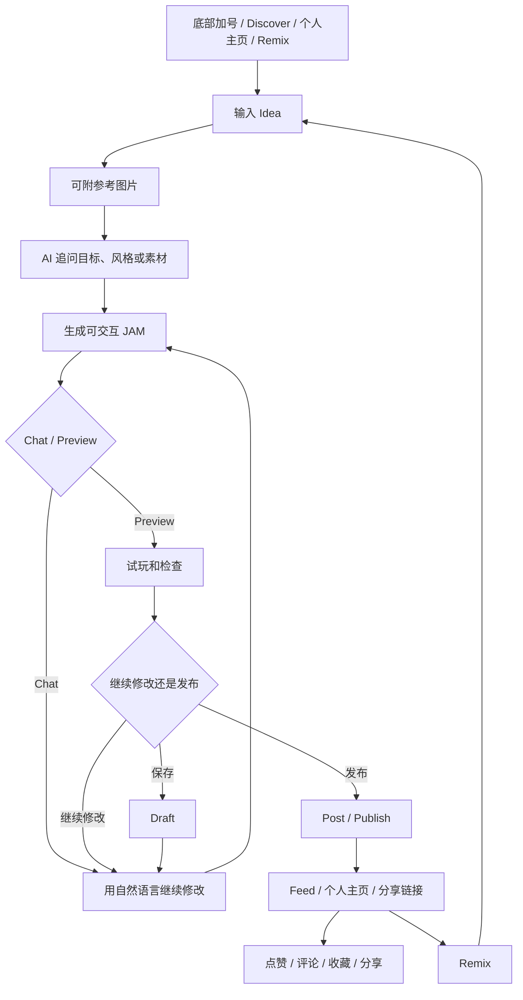
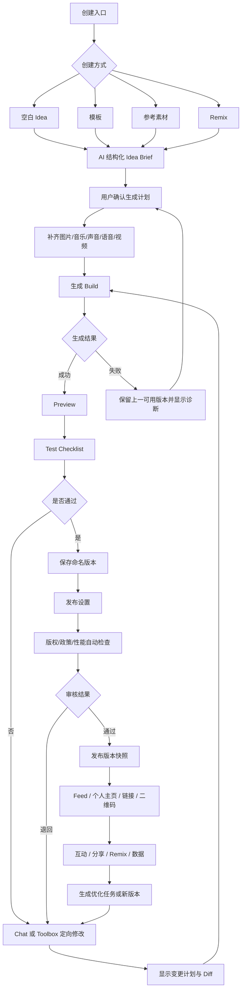

# Sekai APP 全链路创作流程调研与产品需求文档

> 版本：v1.0  
> 调研日期：2026-08-18  
> 文档状态：竞品事实调研 + 对标产品需求建议，不代表 Sekai 官方产品说明，也不代表本项目已实现  
> 适用范围：Idea、素材、图片、音乐、声音、语音、视频、Toolbox、生成、预览、草稿、审核、发布、分享、Remix 与发布后运营  
> 核心原则：先区分“已核实的 Sekai 现状”和“建议建设的完整能力”，再决定本项目如何落地；参考交互机制，不复制品牌、角色、界面、文案或受版权保护素材。

---

## 1. 结论先行

Sekai 当前最有价值的产品结构不是单一的 AI 游戏生成，而是把以下循环压缩到一个移动端创作界面：

`描述 Idea → AI 追问 → 自动生成 → Chat / Preview 切换 → 对话修改 → 保存草稿或发布 → 进入 Feed → 分享或 Remix → 形成新版本`

本次调研可以确认：

1. Sekai 把产品定位为可创建、游玩、Remix 和分享互动 mini-app 的平台；用户以自然语言描述目标，不要求编程。[Sekai 官网](https://sekaiapp.com/) [About](https://sekaiapp.com/about)
2. 官方 Google Play 截图显示创作器具有 `Chat / Preview` 双视图、引用图片附件、对话式追问、音乐选择面板和 `Post` 动作。[Google Play](https://play.google.com/store/apps/details?id=chat.sekai.app&hl=en-US)
3. 官网和商店页面确认 Feed、个人主页、分享、Remix 和社区互动构成发布后的传播闭环。[Sekai 官网](https://sekaiapp.com/) [Google Play](https://play.google.com/store/apps/details?id=chat.sekai.app&hl=en-US)
4. Sekai 社区版本说明披露 JAM 的草稿/发布、搜索、评论、点赞、创作者主页、Remix 和滑动 Feed；这部分属于官方社区发布记录，但证据等级低于商店与官网。[v1.48 发布说明](https://www.reddit.com/r/sekai_multiverse/comments/1peakb3/release_sekai_v1480_drafts_search_remix_swipe/)
5. 当前公开证据不足以确认：完整素材库结构、通用视频编辑、SFX 事件编辑、语音克隆是否已接入当前 JAM、模型导入格式、Toolbox 的全部工具、版本回滚和发布审核规则。App Store 隐私披露中出现 Photos or Videos 与 Audio Data，只能证明其数据声明，不能等同于这些编辑能力已上线。[App Store](https://apps.apple.com/us/app/sekai-create-remix-play/id6504506653)

因此，本 PRD 分为两层：

- **A 层：Sekai 当前可核实流程**——用于竞品理解和体验核验；
- **B 层：建议建设的完整全链路**——补齐素材、声音、视频、Toolbox、版本、审核、发布、回滚和运营治理。

---

## 2. 调研目标与非目标

### 2.1 调研目标

- 还原 Sekai 从创作入口到发布、分享和 Remix 的操作路径；
- 明确 Idea、图片、音乐及其他媒体在工作台中的位置；
- 区分公开已证实功能、历史/社区功能、用户反馈和产品推断；
- 形成可直接用于产品设计、UI、前端、后端、QA 和运营评审的结构化 PRD；
- 为本项目后续创作器升级提供范围、状态、对象、事件与验收标准。

### 2.2 非目标

- 不反向工程 Sekai 的模型、提示词、服务端、推荐算法或审核策略；
- 不复制 Sekai 的品牌、角色、插画、音乐、界面细节或受保护内容；
- 不把社区帖子、应用评论或单个用户创建的 Jam 功能当成平台通用功能；
- 不在没有真机证据时宣称视频、语音、模型导入或高级 Toolbox 已在当前 Sekai JAM 上线；
- 不在本文件中承诺本项目已经具备后端生成、版权审核、真实发布或商业结算能力。

---

## 3. 证据分级

| 等级 | 定义 | 本文使用方式 |
| --- | --- | --- |
| S | Sekai 官网、官方商店描述与官方商店截图 | 可描述为“当前公开可确认” |
| A | Sekai 官方社区发布说明或开发者公开回复 | 描述为“官方社区披露”，仍需真机复核 |
| B | 应用商店用户评价、社区教程、招聘或媒体材料 | 仅用于发现线索、风险和待核实问题 |
| C | 根据截图、交互惯例或单个 Jam 推导 | 必须标记为“产品推断” |
| P | 本 PRD 新增的产品建议 | 不得写成 Sekai 现有能力 |

### 3.1 关键证据边界

| 能力 | 当前判断 | 证据与限制 |
| --- | --- | --- |
| 自然语言创建 | 已确认 | 官网、Google Play 和 App Store 均说明描述目标后由 AI 创建 |
| 图片附件/参考图 | 已确认界面存在 | 官方商店截图出现附图缩略图；格式、数量和用途未公开 |
| Chat / Preview | 已确认 | 官方商店截图可见双视图切换 |
| 音乐选择 | 已确认 | 官方商店截图可见 Add Music、分类、试听、时长与添加按钮 |
| 对话式修改 | 已确认核心方向 | 官网明确可通过描述和 Remix 改变主题、氛围或规则；具体 diff 机制未公开 |
| 草稿与发布 | 官方社区披露 | v1.48 说明 Draft & Publish for JAM；需真机确认当前入口和状态 |
| Feed、点赞、评论、收藏、分享 | 已确认主闭环 | 官网、商店截图与版本说明共同支持 |
| Remix | 已确认主闭环 | 官网与商店确认；公开/仅查看等权限细节主要来自社区内容，待核实 |
| 图片生成/角色图 | 历史能力有迹象，当前 JAM 未完整确认 | v1.42 提到 character image generation 改进，不能直接当作当前 JAM 通用入口 |
| 声音/语音生成 | 历史能力有迹象，当前 JAM 未确认 | v1.42 提到 voice generation；当前工作台入口和能力边界不明 |
| 语音克隆 | 社区教程线索 | 历史教程描述 Your Voices 上传音频流程；当前可用性、同意机制与地区限制不明 |
| 视频编辑/生成 | 未确认 | 隐私披露出现视频数据不等于存在通用视频创作能力 |
| 自有模型导入 | 开发者回复线索 | 用户评价中开发者回复称可导入模型；格式、对象和当前路径不明 |
| Toolbox 完整结构 | 未确认 | 官网只说 App 有更深入的创作工具，未公开完整清单 |
| Undo/历史 | 图标可见，语义未确认 | 官方截图出现回退/历史样式图标，不能据此确认版本管理 |
| 审核、回滚、灰度发布 | 未确认 | 公开材料没有足够产品级规则 |

---

## 4. Sekai 产品结构

### 4.1 产品定位

Sekai 将内容单位从静态帖子变为可交互 mini-app/JAM：用户可以创建、游玩、Remix 和分享。官网展示的内容分类包括 Creative Studio、Photo & Image Studio、AI Creations、Stories、Quizzes & Wordplay、Music & Sound、Simulators、Idle & Clicker、Strategy、Arcade、Action、Roleplay 等。[Sekai 官网](https://sekaiapp.com/)

这意味着 Sekai 的核心对象不是单纯“游戏文件”，而是：

```text
一个可发布的互动作品
├─ 创作意图与对话上下文
├─ 玩法/交互逻辑
├─ 图片、音乐等内容资产
├─ 可运行构建
├─ 发布元数据
├─ 社区互动
└─ Remix 血缘关系
```

### 4.2 已观察的主要入口

| 入口 | 用户意图 | 公开证据 |
| --- | --- | --- |
| 底部中央 `+` | 从空白开始创建 | Google Play 截图 |
| Discover 的 Create Now | 从发现内容进入新建 | Google Play 截图 |
| 个人主页 Create new Jam | 在个人资产下新建 | Google Play 截图 |
| 作品详情 Remix | 基于已有作品建立派生版本 | 官网、商店截图 |
| 外部分享链接 | 打开、游玩、再分享或 Remix | 官网 About |

### 4.3 当前可核实的创作全链路



> 说明：图中的 Draft 由官方社区 v1.48 发布说明支持；发布权限、审核步骤和版本回滚未被当前公开材料充分证明。

---

## 5. Sekai 当前操作流程拆解

### 5.1 阶段一：进入创作

**用户动作**

1. 点击底部 `+`、Discover 的 Create Now、个人主页的新建入口，或某个作品的 Remix；
2. 进入创作对话；
3. 系统建立空白项目或派生项目。

**产品价值**

- 将新建入口放在 Feed、发现和个人资产三个高频场景；
- Remix 不要求用户从零组织完整提示词；
- 原作品和派生作品可形成内容网络。

**待核实**

- 新建后是否必须选择类别；
- Remix 是否复制全部素材与逻辑；
- 原作者可设置的 Remix 权限；
- 派生作品是否必须保留署名和原作链接。

### 5.2 阶段二：Idea 输入与 AI 追问

**已观察行为**

- 用户以自然语言描述要创建的作品；
- 可在消息中附带参考图片；
- AI 根据输入继续追问，例如是否加入歌曲；
- 产品承诺不需要代码或复杂设置。[Sekai About](https://sekaiapp.com/about)

**合理推断**

- 对话上下文同时承担需求收集和修改指令；
- AI 可能将自由文本转换成内部结构，但公开资料未披露具体 Schema；
- 追问数量和问题类型可能随作品类型变化。

**产品风险**

- 用户不知道 AI 将修改哪些内容；
- 多轮对话容易积累互相冲突的指令；
- “帮我优化”可能导致非目标区域被重写；
- 用户评价中出现编辑冻结和 AI 误改反馈，开发者回复承认正在改善稳定性与编辑可靠性。[App Store](https://apps.apple.com/us/app/sekai-create-remix-play/id6504506653)

### 5.3 阶段三：媒体素材加入

#### 图片

官方截图能确认参考图片附件，但不能确认图片生成、裁剪、抠图、图层、角色一致性、替换和版权校验的完整路径。

#### 音乐

官方截图显示：

- `Add Music` 底部面板；
- Suggested、Action、Indie、Puzzle、Arcade 等分类；
- 曲目名、时长、试听和添加动作；
- 音乐可在 AI 追问过程中被加入作品。

尚未确认：曲库授权范围、上传自有音乐、裁剪、循环、音量、淡入淡出、发布地区限制和商用许可。

#### 声音、语音、视频

当前公开证据不足以确认它们是 JAM 创作器中的稳定通用能力。历史版本说明和社区教程只能作为待核实线索，不应直接写入“当前已上线”范围。[v1.42 发布说明](https://www.reddit.com/r/sekai_multiverse/comments/1o6rp22/) [社区语音教程](https://www.reddit.com/r/sekai_multiverse/comments/1hnj45b/)

### 5.4 阶段四：生成与工作台

官方商店截图显示的主要工作台结构：

```text
顶部
├─ 返回
├─ 撤销/历史样式入口（具体语义待核实）
├─ Chat / Preview 分段切换
├─ AI/工具入口
└─ Post

Chat
├─ 用户 Idea 与附件
├─ AI 追问和生成反馈
├─ 媒体选择面板
└─ 新的修改指令

Preview
└─ 当前可运行版本
```

优势是把“需求沟通”和“运行结果”放在同一上下文；不足是公开资料未显示结构化图层、事件、场景、素材、版本和错误面板。

### 5.5 阶段五：预览与迭代

**已确认**

- 可在 Chat 和 Preview 间切换；
- 用户可以继续描述修改；
- 官网支持修改主题、氛围或规则以及 Remix。[Sekai About](https://sekaiapp.com/about)

**未确认**

- 预览是否支持多设备、安全区、弱网、声音开关和重置；
- 是否能查看 AI 将执行的修改计划；
- 是否有逐项 diff、撤销、检查点和版本对比；
- 生成失败是否能保留上一个可运行版本。

### 5.6 阶段六：草稿、发布与分发

**已确认/披露**

- JAM 存在 Draft & Publish；
- 发布后可进入滑动 Feed、个人主页和分享链路；
- 社区支持点赞、评论、收藏、分享与 Remix；
- 官网支持通过链接邀请朋友游玩、投票、反应、竞赛或继续构建。[Sekai About](https://sekaiapp.com/about)

**待核实**

- 发布前元数据、分类、标签和封面是否必填；
- 私密、非公开链接、公开、仅查看、允许 Remix 的具体权限组合；
- 自动审核、人工审核、年龄分级、地区限制和版权声明；
- 已发布版本能否暂停、撤回、回滚或保留旧链接；
- 发布失败、审核拒绝和违规下架的状态与申诉流程。

---

## 6. 竞品结构的优点与主要缺口

### 6.1 值得借鉴

| 结构 | 价值 |
| --- | --- |
| Prompt-first | 新手无需先理解工具栏和参数 |
| AI 主动追问 | 把不完整 Idea 推进成可生成需求 |
| Chat / Preview 双视图 | 沟通、生成、试玩和修改处于同一工作上下文 |
| 在对话中插入音乐等工具 | 工具不会打断用户的创作目标 |
| Post 常驻 | 让生成结果快速进入社区闭环 |
| Remix | 降低二次创作门槛，形成内容网络效应 |
| Feed 即运行环境 | 作品不需要先跳到外部页面才能体验 |

### 6.2 需要补齐或重点核实

| 缺口 | 影响 | 推荐解决方向 |
| --- | --- | --- |
| AI 修改范围不透明 | 容易误改、回退困难 | 生成前显示变更计划和影响范围 |
| 媒体资产治理不可见 | 替换、授权、版本和复用困难 | 独立 Asset Library + Manifest |
| 高级 Toolbox 不清晰 | 复杂作品只能靠反复提示词 | 提供结构化场景、组件、事件和属性面板 |
| 版本与回滚不清晰 | 发布风险高 | 自动检查点、命名版本、发布快照、回滚 |
| 发布权限不清晰 | Remix 与版权边界模糊 | 可见性、可 Remix、署名和商用许可分开设置 |
| 音视频能力边界不清 | 用户预期与产品能力错位 | 创建入口显示可用性、费用、格式和地区限制 |
| 审核治理不可见 | 违规、版权和未成年人风险 | 发布前自动检查 + 必要的人工审批 |
| 失败恢复机制不清 | 生成/编辑失败会损失进度 | 始终保留 last-known-good build |

---

# B 层：建议建设的完整创作全链路 PRD

## 7. 产品定义

### 7.1 产品名称

**AI Interactive Creation Workspace（AI 互动内容创作工作台）**

### 7.2 产品愿景

让没有编程经验的用户通过 Idea 和参考素材生成可运行的互动作品，同时让进阶创作者可以精确管理素材、场景、事件、版本、审核、发布和运营，而不必依赖反复猜测式提示词。

### 7.3 核心价值主张

```text
新手：说清楚想法，就能得到可玩的第一版
进阶创作者：可以控制素材、结构、交互、版本和发布
运营者：可以审核、发布、回滚、归因和持续优化
参与者：可以直接玩、分享和在授权范围内 Remix
```

### 7.4 产品目标

| 目标 | 建议指标 |
| --- | --- |
| 降低首次创作门槛 | 新用户从进入创作到首个可运行预览的完成率 |
| 提高生成可控性 | 首次预览后平均修订次数、非预期修改率、Undo/恢复率 |
| 提高发布成功率 | 预览就绪到发布成功转化率、审核一次通过率 |
| 提高内容质量 | 崩溃率、可玩完成率、素材缺失率、声音异常率 |
| 建立二创循环 | 作品分享率、有效 Remix 启动率、Remix 发布率 |
| 保护创作者资产 | 授权信息完整率、版本可恢复率、违规素材拦截率 |

### 7.5 非目标

- P0 不做专业级视频剪辑器、DAW 或 3D 建模器；
- P0 不允许 AI 自动发布、自动修改版权声明或自动批准商业权益；
- 不让普通用户直接编辑底层源代码、生产凭证、支付或审核规则；
- 不用模型供应商名称替代产品能力；模型路由属于系统层能力。

---

## 8. 用户与权限

| 角色 | 核心任务 | 默认权限 |
| --- | --- | --- |
| 新手创作者 | 从 Idea 快速得到首个可玩版本 | 新建、对话、基础素材、预览、保存草稿 |
| 进阶创作者 | 精确控制素材、场景、事件和版本 | 使用 Toolbox、版本、测试、发布申请 |
| Remix 创作者 | 基于授权作品派生新版本 | 复制可授权部分、修改、保留血缘与署名 |
| 审核者 | 检查政策、版权、品牌、功能和发布条件 | 批准、退回、记录原因；不可修改作品内容 |
| 运营者 | 管理发布、暂停、回滚、分发和数据 | 发布操作、暂停、回滚、分析；不可伪造创作者署名 |
| 参与者 | 游玩、互动、分享、反馈 | 运行作品和社区动作 |

### 8.1 权限原则

- 内容编辑、发布审批、商业配置和平台治理必须分权；
- Remix 只能复制原作者明确授权的逻辑和素材；
- 音乐、字体、图片、视频、声音与语音权利必须逐资产记录；
- 语音克隆需要可验证授权、明确用途、可撤回和可删除；
- 已发布构建不可被静默覆盖，只能产生新版本。

---

## 9. 核心对象模型

| 对象 | 定义 | 关键字段 |
| --- | --- | --- |
| `project` | 一个创作项目 | `project_id`, owner, origin, status, current_version_id |
| `idea_brief` | 结构化创作意图 | objective, audience, format, mechanic, style, duration, references |
| `conversation` | 用户与 AI 的创作上下文 | messages, attachments, decisions, unresolved_questions |
| `asset` | 可复用媒体资产 | type, source, rights, checksum, locale, expiry, review_status |
| `scene` | 可运行内容的场景 | components, layout, transitions, safe_area |
| `component` | UI、角色、对象或媒体实例 | type, props, bindings, asset_id |
| `event_action` | 触发器与动作 | trigger, condition, action, target, analytics_event |
| `build` | 一次可运行构建 | build_id, source_version, state, diagnostics, artifact_url |
| `preview_session` | 一次预览与测试 | device, network, sound, test_results, event_log |
| `version` | 可恢复内容快照 | version_id, parent_id, change_summary, creator, timestamp |
| `release` | 面向用户的发布记录 | release_id, version_id, visibility, permissions, review_status |
| `remix_relation` | 原作与派生作关系 | source_project_id, source_version_id, license, attribution |

### 9.1 素材 Manifest 最小字段

```yaml
asset_id: "asset_..."
type: "image | music | sfx | voice | video | font | model"
filename: "..."
source: "upload | generated | library | remix"
owner_id: "..."
authorization_status: "pending | approved | rejected | expired"
license_scope:
  personal: true
  commercial: false
  remix: false
regions: []
locale: "zh-CN"
checksum: "..."
version: 1
expiry_at: null
usage_restrictions: []
review_status: "pending"
used_by: []
```

---

## 10. 信息架构

```text
创建
├─ Idea
│  ├─ 从空白创建
│  ├─ 从模板创建
│  ├─ 从参考图创建
│  └─ Remix
├─ 创作工作台
│  ├─ Chat
│  ├─ Preview
│  ├─ Assets
│  ├─ Toolbox
│  ├─ Versions
│  └─ Test
├─ 发布
│  ├─ 发布信息
│  ├─ 可见性与 Remix 权限
│  ├─ 权利与合规
│  ├─ 自动检查
│  ├─ 审核
│  └─ 发布成功
└─ 项目详情
   ├─ 版本与发布记录
   ├─ 分享与渠道
   ├─ 数据与反馈
   ├─ Remix 血缘
   └─ 暂停 / 回滚 / 归档
```

---

## 11. 端到端目标流程



---

## 12. 分阶段详细需求

### 12.1 创建入口

**目标**：用户在任意主要内容场景中，两步内进入创建。

**入口**

- 底部主导航 `+`；
- Discover/Create Now；
- 个人主页/新建；
- 作品详情/Remix；
- 模板详情/使用模板；
- 外部 Deep Link。

**规则**

- 点击入口后立即建立本地草稿 ID；
- 若用户未登录，可先体验到首个预览，保存/发布时再登录；
- Remix 入口必须先显示可复制内容、署名、限制和原作链接；
- Deep Link 失败时进入安全的创建首页，不丢失来源参数。

### 12.2 Idea 输入

**必需输入**

- 一句话 Idea；
- 作品类型：游戏、问答、故事、工具、贺卡、模拟器等；
- 主要目标：娱乐、表达、教育、互动、营销等；
- 目标受众与语言；
- 期望时长或复杂度。

**可选输入**

- 参考图片、视频、音频或链接；
- 风格、角色、色彩和声音氛围；
- 玩法机制、成功/失败条件；
- 分享、CTA、Remix 与商业使用要求。

**AI 追问规则**

- 最多先问 1–3 个会显著改变结果的问题；
- 不得重复询问用户已经明确的内容；
- 未知但不阻断第一版生成的内容使用可见默认值；
- 版权、地区、奖励、外部 CTA、语音克隆等高风险问题不得用猜测默认值；
- 生成前输出可确认的结构化 Brief 和本次生成计划。

### 12.3 生成计划确认

系统应在首次生成和高影响修改前显示：

- 将创建/修改的场景；
- 核心玩法；
- 新增、保留、替换和删除的素材；
- 音乐、声音和语音使用位置；
- 成功、失败、重试、分享和 CTA 状态；
- 预计复杂度和可能受限能力；
- 需要用户确认的版权或合规事项。

用户可选择：`确认生成`、`修改计划`、`保存 Idea`、`取消`。

### 12.4 Assets 素材中心

**分类**

`全部 / 图片 / 视频 / 音乐 / SFX / 语音 / 字体 / 模型 / 我的上传 / AI 生成 / 收藏`

**每个素材卡必须显示**

- 缩略图或波形；
- 类型、名称、来源和版本；
- 授权状态和适用范围；
- 已使用场景数；
- 预览、替换、复制、下载、删除或解除绑定；
- 生成素材的提示词、生成时间和血缘。

**删除规则**

- 被场景引用的素材不可直接物理删除；
- 先提示受影响场景，并提供替换或解除绑定；
- 已发布版本引用的素材只可从当前草稿解除，不可破坏历史发布快照。

### 12.5 图片创作

**支持动作**

- 上传、拍摄、从图库选择、从授权库选择、AI 生成；
- 裁剪、旋转、缩放、透明背景、主体抠图；
- 角色/物体/背景分类；
- 风格参考与角色一致性锁定；
- 生成变体、局部重绘、替换背景；
- 绑定到封面、角色、道具、背景或 UI。

**一致性要求**

- 角色素材建立 `character_id`；
- 封面角色和游戏内角色必须能绑定同一个角色参考集；
- 生成新动作或表情时保留发型、服装、色彩、比例和关键识别特征；
- 提供一致性评分和人工确认，不自动覆盖已通过素材。

**验收底线**

- 不拉伸、不出现透明黑边、不模糊；
- 必须有移动端适配裁剪；
- 权利状态未通过时不能进入公开或商业发布。

### 12.6 音乐创作

**来源**

- 平台授权曲库；
- 用户上传；
- AI 生成；
- Remix 可复用音乐（仅在原许可允许时）。

**功能**

- 分类、搜索、试听、收藏、添加；
- 时长、起始点、裁剪、循环、淡入淡出；
- 主音量、背景降噪、与语音自动 ducking；
- 场景切换或状态触发；
- 授权地区、商用、Remix 和到期提示。

**默认策略**

- 预览默认尊重系统静音状态；
- 首次自动播放前说明声音行为；
- 音乐不可遮盖主要语音和关键反馈；
- 发布检查必须验证授权与到期日期。

### 12.7 SFX 声音效果

**事件模板**

- `game_start`、点击、拖拽、碰撞、收集、受击、升级；
- 正确、错误、成功、失败、重试、分享、CTA；
- 自定义事件。

**功能**

- 搜索、试听、添加、裁剪、音量、声道和平衡；
- 将声音拖放到事件；
- 同一事件支持优先级、冷却时间和最大并发数；
- Preview 中可单独静音音乐、SFX 和 Voice；
- 避免快速事件造成声音堆叠和削波。

### 12.8 Voice 语音

**能力层级**

1. 文本转语音；
2. 用户录音上传；
3. 已授权角色声音；
4. 语音克隆（高风险、后置能力）。

**必要功能**

- 声线、语言、情绪、语速、停顿和发音词典；
- 按角色和台词管理；
- 单句试听、批量生成和替换；
- 字幕自动生成与人工校对；
- 音乐 ducking；
- 删除、撤回授权和重新生成。

**语音克隆强制条件**

- 明确、可验证的声音权利人同意；
- 明示用途、地区、期限、可撤回与删除；
- 禁止克隆未授权公众人物、未成年人或第三方声音；
- 发布时可按政策显示 AI/合成语音披露；
- 撤回授权后阻止新发布，并保留合规审计记录。

### 12.9 视频创作

**P1 范围**

- 上传、拍摄、AI 生成或从授权库选择；
- 裁剪、封面帧、静音、循环、适配、字幕；
- 绑定到开场、背景、过场、结果或分享卡；
- 移动端转码、码率和首帧优化；
- 视频失败时使用海报图回退。

**明确非目标**

- 不在创作器内实现多轨专业剪辑；
- 不提供未经授权的人脸替换、声音替换或风格仿制；
- 大文件、横屏和高码率素材必须在导入时提示压缩影响。

### 12.10 Toolbox

Toolbox 解决“用户知道要改什么，但不希望继续靠模糊提示词”的问题。

| 工具组 | P0 能力 | P1/P2 能力 |
| --- | --- | --- |
| Select | 选择场景、组件、素材 | 多选、锁定、成组 |
| Layout | 位置、尺寸、层级、对齐、安全区 | 响应式约束、锚点 |
| Style | 颜色、字体、圆角、透明度 | Token、主题和状态样式 |
| Scene | 新增、复制、排序、切换 | 条件场景、过场动画 |
| Interaction | 点击、拖拽、滑动、计时 | 传感器、手势组合、物理 |
| Logic | 成功、失败、计分、重试 | 条件、变量、数据绑定 |
| Media | 图片、音乐、SFX、Voice、Video | 动态媒体和生成管线 |
| AI Edit | 对选中范围进行自然语言修改 | 多步计划、Agent 工具链 |
| Data | 事件名称和属性 | 漏斗、实验、远程配置 |
| Debug | 重置、事件日志、错误 | 性能、网络、权限模拟 |
| Accessibility | 对比度、字号、替代文本 | 屏幕阅读器顺序、运动降级 |
| Version | Undo/Redo、检查点 | Diff、分支、合并、回滚 |

**范围编辑原则**

- 用户选中一个对象后发出 AI 指令，默认只允许修改该范围；
- 若指令影响其他对象，生成前必须列出依赖和影响；
- 删除、替换资产、改变玩法目标或发布规则属于高影响修改，必须二次确认；
- 普通用户看到能力名称，不看到底层模型供应商。

### 12.11 Build 生成

**状态**

`queued → planning → generating_assets → compiling → validating → preview_ready | failed | cancelled`

**要求**

- 显示当前阶段，不伪造百分比；
- 支持取消和重试；
- 网络中断后可恢复状态；
- 新生成失败时保留上一个可运行 Build；
- 错误信息包含用户可理解原因和下一步；
- 生成日志用于诊断，但不向普通用户暴露敏感系统提示或密钥。

### 12.12 Preview 预览

**控制项**

- Chat / Preview 即时切换；
- 重置、暂停、重玩；
- 音乐、SFX、Voice 独立静音；
- 360/390/430 宽度和常见安全区；
- 正常、弱网、离线和权限拒绝；
- 分享预览链接；
- 事件日志与测试用例结果。

**预览检查单**

- 首屏加载和首个交互；
- 核心玩法可完成；
- 成功、失败、重试和退出；
- 文案、图片、音乐、声音、语音和视频；
- 触摸目标、安全区和键盘遮挡；
- 旋转、前后台、声音中断和返回；
- 分享、Remix、CTA 和埋点；
- 无网络、素材失败和生成错误回退。

### 12.13 对话修改与版本

**每次修改流程**

1. 用户输入修改指令；
2. 系统识别目标范围；
3. 展示修改计划；
4. 用户确认；
5. 创建自动检查点；
6. 生成新 Build；
7. 显示前后差异和测试结果；
8. 接受、继续编辑或回退。

**版本类型**

- 自动保存；
- AI 修改前检查点；
- 用户命名版本；
- 审核提交版本；
- 发布快照；
- 回滚版本。

### 12.14 发布设置

**内容信息**

- 标题、封面、描述、分类、标签、语言；
- 内容警告、年龄建议和 AI 内容披露；
- 作者、共同创作者和来源署名。

**可见性**

- Private；
- Unlisted/仅链接；
- Public。

**Remix 权限**

- 禁止 Remix；
- 仅查看；
- 允许 Remix，但必须署名；
- 允许 Remix 并允许指定范围的素材复用；
- 商业 Remix 需要独立许可。

**社区与传播**

- 评论开关；
- 分享卡预览；
- Deep Link 与二维码；
- 外部嵌入或应用内运行权限。

**发布前声明**

- 确认素材、音乐、声音、视频、字体和语音权利；
- 确认没有未经授权的个人信息和品牌资产；
- 确认地区、年龄和内容规则；
- 显示检测结果和仍需人工判断的风险。

### 12.15 自动检查与审核

| 检查域 | 自动检查 | 人工判断 |
| --- | --- | --- |
| 功能 | 构建、崩溃、死路、重试、素材 404 | 玩法是否与描述一致 |
| 性能 | 首屏、包体、帧率、内存、视频码率 | 体验是否可接受 |
| 内容 | 敏感内容、个人信息、违规词 | 语境、讽刺、未成年人风险 |
| 权利 | Manifest、授权状态、过期、来源 | 授权文件真实性和范围 |
| AI/语音 | 合成内容标识、语音同意状态 | 欺骗、冒用和人格权风险 |
| 发布 | 元数据、封面、安全区、链接 | 品牌、地区、营销声明 |

**审核状态**

`not_submitted → checking → needs_fix → pending_manual_review → approved → rejected → revoked`

退回必须包含：问题、证据、受影响对象、可执行修复建议和重新提交入口。

### 12.16 发布与发布后运营

**发布成功页**

- 运行作品；
- 复制链接；
- 生成二维码；
- 分享到系统分享面板；
- 查看 Feed/个人主页；
- 创建下一版本。

**项目详情**

- 当前发布状态和版本；
- 浏览、开始、有效互动、完成、分享和 Remix；
- 评论和问题反馈；
- 版本与发布记录；
- 暂停、恢复、撤回和回滚；
- 原作与 Remix 血缘；
- 素材授权到期预警。

**发布操作原则**

- 暂停不删除历史数据；
- 回滚创建新的 release 记录，不覆盖审计历史；
- 链接是否指向“最新版本”或“固定版本”必须明确；
- 已发布版本的素材授权到期时，先告警，再按政策暂停或替换，不静默变更。

---

## 13. 页面级 PRD

| ID | 页面 | 核心内容 | 主动作 | 必须状态 |
| --- | --- | --- | --- | --- |
| S01 | 创建入口 | 空白、模板、参考素材、Remix | 开始创建 | 默认、未登录、离线 |
| S02 | Idea 对话 | 输入框、附件、建议 Prompt | 提交 Idea | 空、上传中、失败 |
| S03 | Brief 确认 | 目标、受众、机制、风格、素材、风险 | 确认生成 | 缺失、冲突、待确认 |
| S04 | 创作工作台 | Chat/Preview、顶部状态、Post | 生成/预览 | 生成中、可预览、失败 |
| S05 | Assets | 分类、搜索、授权、使用关系 | 添加素材 | 空、上传、处理中、拒绝 |
| S06 | 图片编辑 | 生成/上传、裁剪、一致性、绑定 | 应用图片 | 原图、生成中、待审核 |
| S07 | Audio | Music/SFX/Voice、波形、事件绑定 | 添加/应用 | 播放、生成、授权异常 |
| S08 | Video | 上传/生成、裁剪、封面、字幕 | 应用视频 | 转码、失败、回退 |
| S09 | Toolbox | 场景、组件、交互、逻辑、样式 | 应用修改 | 选中、依赖、冲突 |
| S10 | Versions | 时间线、摘要、对比、恢复 | 创建/恢复版本 | 自动、命名、发布快照 |
| S11 | Test | 用例、设备、声音、事件、错误 | 运行检查 | 通过、失败、阻断 |
| S12 | Publish | 元数据、可见性、Remix、权利 | 提交审核 | 草稿、缺项、可提交 |
| S13 | Review | 检查结果、修复建议、人工状态 | 修复/重新提交 | checking、needs_fix、approved |
| S14 | Success | 链接、二维码、运行、分享 | 分享/查看作品 | 发布成功、部分渠道失败 |
| S15 | Project | 数据、反馈、版本、Remix、状态 | 新版本/暂停/回滚 | 运行、暂停、撤回、归档 |

---

## 14. 功能需求清单

### 14.1 P0：必须具备

| ID | 需求 | 验收标准 |
| --- | --- | --- |
| FR-001 | 多入口新建与 Remix | 入口能建立唯一草稿；Remix 保留原作关系 |
| FR-002 | Idea 对话与附件 | 文本和图片可提交；失败可重试且不丢输入 |
| FR-003 | 结构化 Brief | 生成前显示目标、类型、机制、风格、素材和未知项 |
| FR-004 | AI 追问 | 只询问会显著影响结果的问题；高风险未知项不可猜测 |
| FR-005 | 生成计划 | 首次生成和高影响修改前显示计划并获得确认 |
| FR-006 | Chat/Preview 双视图 | 切换不丢对话、运行状态和当前选中对象 |
| FR-007 | 图片素材 | 支持上传/选择/生成、裁剪、绑定、授权状态 |
| FR-008 | 音乐素材 | 支持分类、试听、添加、音量、循环和授权状态 |
| FR-009 | 素材 Manifest | 所有发布素材具有来源、权利、版本和引用关系 |
| FR-010 | 范围化 AI 编辑 | 默认只修改选中范围；跨范围修改须提示 |
| FR-011 | Last-known-good Build | 新 Build 失败时仍可运行上一可用版本 |
| FR-012 | 自动保存与检查点 | 意外退出后能恢复；高影响修改前自动保存 |
| FR-013 | Undo/Redo 与命名版本 | 可撤销当前编辑并恢复到指定版本 |
| FR-014 | 预览控制 | 重置、重玩、声音开关、移动端尺寸和安全区可检查 |
| FR-015 | 核心测试 | 成功、失败、重试、素材加载、分享和事件均有结果 |
| FR-016 | 草稿 | 未发布内容可保存、继续和归档 |
| FR-017 | 发布信息 | 标题、封面、描述、分类、语言和作者完整 |
| FR-018 | 可见性与 Remix 权限 | 可见性与复用权利分开设置且发布后可追溯 |
| FR-019 | 发布前检查 | 功能、素材权利、性能和政策问题可阻断发布 |
| FR-020 | 版本化发布 | 发布生成不可变 release 记录和可运行链接 |
| FR-021 | 分享与 Feed | 发布成功可复制链接、分享并进入作品页 |
| FR-022 | 暂停与回滚 | 可暂停公开访问并回滚到已批准版本 |

### 14.2 P1：增强能力

| ID | 需求 | 验收标准 |
| --- | --- | --- |
| FR-101 | SFX 事件绑定 | 常见事件可绑定声音并在 Preview 独立静音 |
| FR-102 | TTS 与角色台词 | 多语言、单句试听、字幕和批量替换可用 |
| FR-103 | 视频素材 | 上传、转码、裁剪、封面、字幕和失败回退可用 |
| FR-104 | 高级 Toolbox | 场景、组件、样式、事件和逻辑可结构化编辑 |
| FR-105 | 版本 Diff | 能看到场景、逻辑、素材和文案的前后差异 |
| FR-106 | 预览分享 | 私密预览链接有权限和有效期 |
| FR-107 | 项目分析 | 具备作品级核心漏斗、反馈和 Remix 数据 |
| FR-108 | 素材到期治理 | 到期前告警并能定位全部受影响作品 |

### 14.3 P2：高级能力

| ID | 需求 | 验收标准 |
| --- | --- | --- |
| FR-201 | 语音克隆 | 同意、用途、撤回、删除和发布披露完整 |
| FR-202 | 角色一致性生成 | 封面和游戏内动作/表情保持角色参考特征 |
| FR-203 | 多人协作 | 权限、评论、锁定、冲突和版本记录完整 |
| FR-204 | 分支与合并 | 可从稳定版本创建实验分支并选择性合并 |
| FR-205 | 远程配置与实验 | 不重新发布即可调整获批参数，保留审计 |
| FR-206 | 能力路由 | 按任务、质量、速度、成本和合规路由，不暴露供应商耦合 |

---

## 15. 状态机

### 15.1 项目状态

```text
idea_draft
  → brief_ready
  → generating
  → preview_ready
  → editing
  → test_ready
  → review_pending
  → approved
  → published
  → paused
  → archived
```

例外状态：

- `generation_failed`：可返回上一个 `preview_ready`；
- `needs_fix`：退回 `editing`；
- `rejected`：保留草稿和审核原因；
- `revoked`：停止公开访问但保留审计与版本；
- `rights_expired`：阻止新发布，根据政策处理在运行版本。

### 15.2 Build 状态

```text
queued → planning → generating_assets → compiling → validating
                                      └→ failed
validating → preview_ready
任意未完成状态 → cancelled
```

### 15.3 Release 状态

```text
draft → checking → pending_review → approved → publishing → live
                   ├→ needs_fix
                   └→ rejected
live → paused → live
live → rolled_back
live → revoked
```

---

## 16. 关键事件与指标

### 16.1 创作漏斗

| 事件 | 触发时机 | 关键属性 |
| --- | --- | --- |
| `create_entry_clicked` | 点击创建入口 | entry, source_project_id |
| `idea_submitted` | 提交首次 Idea | input_type, attachment_count, category |
| `clarification_answered` | 回答 AI 追问 | question_type, round_index |
| `brief_confirmed` | 确认 Brief | unknown_count, risk_count |
| `asset_added` | 添加素材 | asset_type, source, authorization_status |
| `generation_started` | 发起生成 | project_id, version_id, complexity |
| `generation_succeeded` | 首个 Build 可预览 | duration, warnings, asset_count |
| `generation_failed` | 生成失败 | stage, error_code, recoverable |
| `preview_started` | 运行预览 | build_id, device_profile |
| `edit_plan_confirmed` | 确认修改计划 | scope, affected_object_count |
| `version_created` | 创建版本 | version_type, parent_version_id |
| `test_completed` | 测试完成 | passed, failed_count, blocker_count |
| `review_submitted` | 提交审核 | release_id, risk_count |
| `review_completed` | 审核结束 | result, reason_codes |
| `publish_succeeded` | 发布完成 | visibility, remix_permission |
| `share_completed` | 完成分享 | channel, release_id |
| `remix_started` | 开始 Remix | source_project_id, license |
| `remix_published` | 派生作品发布 | source_version_id, retained_asset_count |

### 16.2 核心指标

- 首次可运行预览率；
- Idea 到首个 Preview 中位时长；
- 生成失败率和可恢复率；
- 首次 Preview 到 Publish 转化率；
- 平均有效修订次数；
- AI 非预期修改率；
- 发布前阻断问题分布；
- 发布后崩溃率和有效互动完成率；
- 分享率、Remix 启动率和 Remix 发布率；
- 素材授权完整率和到期事故率。

> 所有转化率必须定义分子、分母、时间窗、去重方式和排除规则，不能只展示模糊百分比。

---

## 17. 非功能需求

### 17.1 可用性与恢复

- 输入 500ms 内本地保存，10 秒内完成云端同步或显示未同步；
- App 退出、崩溃或切后台后能够恢复最近草稿；
- 生成和转码任务可断线重连；
- 新版本失败不破坏上一可用 Build；
- 所有高影响动作可撤销或通过版本恢复。

### 17.2 性能

- 工作台首屏优先显示结构和最近可用预览；
- 媒体使用分辨率、码率和懒加载策略；
- 预览需要记录首屏、首个可交互、帧率、内存和素材失败；
- 低端设备提供视频、粒子和动画降级；
- 发布检查对包体、音视频和长任务给出明确阻断阈值。

### 17.3 移动端与可访问性

- 覆盖 360、390、430 CSS 像素宽度；
- 适配 iOS/Android 安全区、系统导航、键盘和音频中断；
- 交互目标满足移动端可触达范围；
- 文本支持缩放、对比度、替代文本和减少动态效果；
- 所有声音信息具有视觉反馈，所有视觉关键结果具有可读文本。

### 17.4 隐私、安全与权利

- 上传前说明用途、保存期限和删除方式；
- 不把用户素材用于额外模型训练，除非获得独立、明确同意；
- 语音、人脸、未成年人和精确身份素材采用更高权限与审核；
- 权利记录与发布记录不可被普通编辑权限篡改；
- 不把密钥、内部 Prompt、访问令牌或个人信息写入可下载构建；
- 删除账户或撤回授权时，需要处理草稿、公开作品、Remix 依赖和审计保留的差异。

---

## 18. 异常与边界场景

| 场景 | 期望处理 |
| --- | --- |
| 用户 Idea 太短 | 给 2–3 个可选补充问题，不阻断轻量首版 |
| 多轮指令冲突 | 列出冲突和最后生效规则，要求确认 |
| AI 计划删除多个对象 | 显示影响清单并二次确认 |
| 图片生成失败 | 保留原图或占位，允许重试/换来源 |
| 音乐授权不适用于地区 | 阻断对应地区发布并推荐可替代曲目 |
| 语音授权撤回 | 阻止新发布，定位依赖，提供替换流程 |
| 视频转码失败 | 使用海报图预览，发布前仍须修复或移除 |
| Build 失败 | 自动回到上一可运行版本，保留诊断 |
| 预览链接泄露 | 可撤销、设置有效期和访问权限 |
| 审核期间继续编辑 | 审核版本冻结；编辑创建新草稿版本 |
| 已发布后修改 | 产生新版本和新审核，不静默覆盖 |
| 原作禁止 Remix | 不展示 Remix 动作，已有派生关系保留审计 |
| 原作素材许可到期 | 告警所有派生作，按各自许可处理 |
| 设备拒绝麦克风/相机/传感器 | 提供不依赖权限的替代交互 |

---

## 19. MVP 分期

### 19.1 Phase 0：竞品真机核验，1 周

- 使用最新版 iOS 与 Android 真机建立 Sekai 流程录屏；
- 核实创建入口、追问、图片、音乐、Toolbox、Preview、Draft、Post、Remix 和权限；
- 使用测试素材，不上传真实敏感信息；
- 记录每个页面、状态、错误和时间；
- 输出“已确认/不存在/账号或地区受限/仍不确定”矩阵。

### 19.2 Phase 1：P0 创作闭环，建议 6–10 周

- Idea + 图片附件；
- 结构化 Brief 和生成计划；
- 图片与音乐素材；
- Chat/Preview；
- 范围化修改、Last-known-good Build；
- 自动保存、版本和核心测试；
- 草稿、发布设置、权限、自动检查；
- 版本化发布、分享和基础 Remix。

### 19.3 Phase 2：媒体与精确控制，建议 6–8 周

- SFX、TTS、视频；
- 场景/组件/事件/样式 Toolbox；
- 版本 Diff、私密预览、项目分析；
- 素材授权到期治理。

### 19.4 Phase 3：高级创作与运营

- 语音克隆与更严格的同意治理；
- 角色一致性生成；
- 多人协作、分支和合并；
- 远程配置、实验和能力路由；
- 更完整的发布、运营、归因和优化闭环。

---

## 20. P0 验收场景

1. 新用户输入一句 Idea 并附一张图片，能够得到结构化 Brief 和首个可运行预览。
2. 用户在生成前看到将新增的场景、玩法、图片和音乐，并可修改计划。
3. 用户从音乐面板试听并添加曲目，Preview 能播放，系统静音时不强制出声。
4. 用户选中按钮后要求“改成红色并放大”，系统只修改该按钮；跨对象影响必须提示。
5. 新 Build 失败时，用户仍可运行上一版本并看到可执行的失败原因。
6. App 被关闭后重新打开，Idea、附件、对话和最近版本完整恢复。
7. 用户能测试成功、失败、重试、分享和核心事件，阻断项未通过时不能发布。
8. 发布前能设置 Private、Unlisted、Public，以及独立的 Remix 权限。
9. 未授权或已过期素材会阻断公开发布，并定位具体素材和替代路径。
10. 发布成功后生成固定 release 记录、可运行链接和分享入口。
11. 用户修改已发布作品时产生新草稿和版本，不改变线上版本。
12. 运营者可暂停作品并回滚到已审核版本，历史记录和数据不被删除。

---

## 21. Sekai 真机待核实清单

以下问题必须通过当前版本真机操作或 Sekai 官方文档确认：

### 创建与计费

- 是否必须登录才能生成或预览；
- 免费额度、积分、订阅、生成次数和失败是否扣费；
- 一次创建的实际追问轮次和生成耗时；
- 不同类型 JAM 是否进入相同工作台。

### 素材

- 图片、音频、视频支持格式、大小、数量和时长；
- 是否支持相机、相册、文件、URL 和云盘；
- 图片生成、抠图、角色一致性和替换能力；
- 自有模型导入的对象、格式、入口和权限；
- 上传与生成素材的版权、训练和删除规则。

### 音乐、声音和语音

- 音乐库来源、授权、上传、裁剪、循环和商用范围；
- SFX 是否能绑定事件；
- 当前 JAM 是否支持 Voice/TTS/Voice Clone；
- 语音授权、同意、撤回、删除和地区限制；
- 背景音乐、SFX 和 Voice 是否可独立控制。

### 视频

- 当前 JAM 是否支持上传、生成、裁剪或仅能在特定模板中使用；
- 转码、封面、字幕、自动播放和大小限制；
- 视频是否可导出或仅在 Sekai 内运行。

### Toolbox 与版本

- Toolbox 具体工具清单；
- 历史图标是 Undo、版本还是生成历史；
- 是否支持多选、图层、场景、组件、事件、变量和数据；
- 是否有自动保存、命名版本、对比和恢复；
- AI 修改是否显示计划或差异。

### 预览、审核和发布

- Preview 的设备、声音、重置、Debug 和分享能力；
- Draft 的保存位置、同步和恢复；
- 发布必填字段与可见性；
- Public & Remixable、View Only 等权限的真实入口；
- 自动审核、人工审核、拒绝、申诉、暂停和回滚；
- 发布链接是固定版本还是自动指向最新版。

---

## 22. 对本项目的映射建议

Sekai 的低门槛 `Idea → Preview → Post → Remix` 值得作为创作体验前台，但本项目涉及 KOL、品牌、互动营销、归因和商业交付时，不能只保存一串对话。

建议采用双层流程：

```text
个人/非商业创作
Idea → Brief Lite → Build → Preview → Draft → Publish → Share/Remix

KOL/品牌商业创作
Campaign Brief → Campaign Contract → Assets/PlayableConfig
→ Build → Preview/QA → 审核 → 发布/回滚
→ 互动/归因 → 优化版本 → 交付/结算
```

### 22.1 必须锁定的商业字段

预算、奖励、CTA 目标、地区、合规声明、结算、归因、数据政策和 Kill Switch 不应被普通 AI 对话或 KOL 自由修改。AI 可以提出建议，但必须通过结构化变更、权限和审批。

### 22.2 Agentic Playable 对象关系

```text
一个 KOL/用户
  → 多个 Agentic Playable
      → 每个 Playable 多个持续迭代版本
          → 每次正式发布对应不可变 release
```

品牌、核心目标、主要结算指标、目标地区/合规规则、主要受众或商业 Campaign 改变时，应创建新的 `playable_id`；视觉主题、开场文案、难度、玩法细节、CTA 时机和奖励展示变化通常形成新版本。

### 22.3 本项目推荐入口

- 创作者中心：新建 Agentic Playable；
- 创作灵感：一键生成 Brief 草稿；
- 商业机会：先确认资格和 Campaign Contract，再进入工作台；
- 我的作品：继续草稿、生成版本、审核发布和查看数据；
- 作品详情：新版本、复制到新 Campaign、暂停、回滚、归因和结算。

---

## 23. 研发交付物

进入实施前至少需要以下文档和对象：

1. 页面流程图和低保真原型；
2. Idea Brief Schema；
3. Asset Manifest Schema；
4. Scene/Component/Event Schema；
5. Build、Version、Release 状态机；
6. 发布权限与 Remix 许可矩阵；
7. 媒体格式、大小、转码和授权规则；
8. 自动检查和人工审核规则；
9. 事件字典和指标口径；
10. 移动端、弱网、权限、音频和生命周期 QA 清单；
11. 发布、暂停、回滚和 Kill Switch SOP；
12. 当前真实能力、演示能力和待接后端的 UI 标记规范。

---

## 24. 公开资料来源

### S 级：官网与商店

- [Sekai 官网](https://sekaiapp.com/)：产品定位、内容分类、创建/游玩/Remix/分享主张。
- [Sekai About](https://sekaiapp.com/about)：自然语言创建、Remix 和链接分享闭环。
- [Google Play](https://play.google.com/store/apps/details?id=chat.sekai.app&hl=en-US)：当前应用描述和官方商店截图；截图用于核实 Chat/Preview、图片附件、Add Music、Post、Discover、Feed 和个人主页。
- [Apple App Store](https://apps.apple.com/us/app/sekai-create-remix-play/id6504506653)：当前版本信息、应用描述、隐私声明、用户评价与开发者回复。

### A/B 级：官方社区、社区教程和补充材料

- [Sekai v1.48 官方社区发布说明](https://www.reddit.com/r/sekai_multiverse/comments/1peakb3/release_sekai_v1480_drafts_search_remix_swipe/)：Draft/Publish、搜索、评论、点赞、创作者主页、Remix、滑动 Feed。
- [Sekai v1.45 官方社区发布说明](https://www.reddit.com/r/sekai_multiverse/comments/1ovh58y/)：Creation Lab、Game Panel、Personas 的阶段性发布线索。
- [Sekai v1.42 官方社区发布说明](https://www.reddit.com/r/sekai_multiverse/comments/1o6rp22/)：历史 Voice Generation 和 Character Image Generation 改进线索。
- [社区 Voice Clone 教程](https://www.reddit.com/r/sekai_multiverse/comments/1hnj45b/)：历史入口线索，不能证明当前 JAM 可用性。
- [社区 Remix 使用建议](https://www.reddit.com/r/sekai_multiverse/comments/1t8zds7/tips_on_remixing_a_sekai_sekais_are_also_called/)：Public & Remixable/View Only 权限线索，需真机核实。
- [Canvas Symphony JAM](https://sekaiapp.com/play/canvas-symphony-midi-art-1f729399)：单个用户作品展示的图片/视频上传、工具栏和录制能力；只代表该 Jam 内部功能，不能视为平台通用创作器功能。
- [Axios 关于 Sekai mini-app 的报道](https://www.axios.com/2026/06/01/sekai-mini-app-startup-funding)：独立媒体对 prompt-to-mini-app 和 Remix 定位的补充描述。

---

## 25. 最终建议

1. 先用当前 Sekai iOS/Android 真机完成第 21 节核实清单，不根据旧版社区内容设计当前功能。
2. 产品体验借鉴 Sekai 的 Prompt-first、Chat/Preview、快速 Post 和 Remix 循环。
3. 产品治理不要照搬“对话即全部需求”：正式生产必须有结构化 Brief、素材 Manifest、版本、测试、审核和 release。
4. P0 先把图片、音乐、范围化编辑、Last-known-good Build、版本和发布权限做扎实，再增加视频和语音克隆。
5. 所有高级媒体功能都必须同时设计授权、到期、删除、Remix 和商业使用边界。
6. 普通用户看到“能力”，专业用户看到“Toolbox”，系统内部再做模型和供应商路由，避免界面被技术名词占据。
7. 发布不是一个按钮，而是 `预览通过 → 权利与政策检查 → 审核 → 不可变版本发布 → 可暂停/回滚 → 运营与二创` 的完整生命周期。
